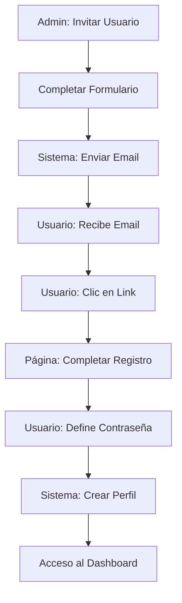

# 🎉 SISTEMA DE INVITACIONES IMPLEMENTADO EXITOSAMENTE

## ✅ RESUMEN DE LA IMPLEMENTACIÓN

Se ha implementado completamente el **sistema de invitaciones por email** que permite a los administradores invitar nuevos usuarios de manera segura, eliminando la función problemática anterior de crear usuarios directamente.

## 🛠️ COMPONENTES IMPLEMENTADOS

### **1. Hook `useInviteUser` - Invitación Segura**
- ✅ Contraseña temporal aleatoria con `crypto.randomUUID()`
- ✅ Metadatos incluidos (nombre, rol, estado)
- ✅ Redirect a página de completar invitación
- ✅ Manejo de errores específicos (usuarios ya registrados)

### **2. Página `CompleteInvitationPage` - Experiencia de Usuario**
- ✅ Verificación segura de tokens de invitación
- ✅ Formulario para definir contraseña personal
- ✅ Creación automática de perfil de usuario
- ✅ Validación de contraseñas (mínimo 8 caracteres)
- ✅ Navegación automática al dashboard tras completar

### **3. Rutas Actualizadas - Acceso Público**
- ✅ Ruta `/complete-invitation` fuera del sistema de autenticación
- ✅ Estructura de rutas públicas vs. protegidas

### **4. UI/UX del Panel de Administración**
- ✅ Botón "Invitar Usuario" (antes "Crear Usuario")
- ✅ Modal con texto "Enviar Invitación"
- ✅ Mensajes de éxito/error contextuales
- ✅ Activación rápida para usuarios pendientes

## 🔄 FLUJO COMPLETO DE INVITACIÓN

## 📋 FUNCIONALIDADES CLAVE

### **Para Administradores:**
- **Invitación Simple**: Email, nombre, rol y estado
- **Control Total**: Asignación de roles antes de la activación
- **Gestión Visual**: Botones de activación rápida para usuarios pendientes
- **Feedback Inmediato**: Notificaciones de éxito/error

### **Para Usuarios Invitados:**
- **Seguridad**: Link de invitación con token único
- **Autonomía**: Definición de contraseña personal
- **Simplicidad**: Proceso de 2 pasos (email → completar)
- **Inmediatez**: Acceso directo tras completar

## 🛡️ CARACTERÍSTICAS DE SEGURIDAD

1. **Token de Verificación**: Cada invitación tiene un token único y temporal
2. **No Service Role**: No expone claves administrativas en el frontend
3. **Contraseña Personal**: Usuario define su propia contraseña segura
4. **Verificación de Email**: Confirmación automática vía Supabase Auth
5. **Expiración**: Los tokens de invitación tienen tiempo límite

## 🧪 INSTRUCCIONES DE PRUEBA

### **Prueba como Administrador:**

1. **Acceder al panel**:
   - Inicia sesión como admin
   - Ve a "Administración > Usuarios"

2. **Invitar usuario**:
   - Clic en "Invitar Usuario"
   - Completa: `test@ejemplo.com`, `Usuario Prueba`, rol `analista`
   - Clic en "Enviar Invitación"
   - Verifica mensaje de éxito

3. **Verificar en tabla**:
   - El usuario NO aparecerá hasta completar la invitación
   - Esto es el comportamiento esperado

### **Prueba como Usuario Invitado:**

1. **Revisar email**:
   - Busca email de Supabase con subject "Confirm your signup"
   - Haz clic en "Confirm your account"

2. **Completar registro**:
   - Serás redirigido a `/complete-invitation`
   - Completa tu nombre y contraseña
   - Clic en "Completar Registro"

3. **Acceso inmediato**:
   - Serás redirigido automáticamente al dashboard
   - Tu perfil estará activado con el rol asignado

## ⚠️ CONSIDERACIONES IMPORTANTES

### **Email de Invitación:**
- El email viene de Supabase (no personalizado)
- Subject: "Confirm your signup"
- Contiene link para completar registro

### **Usuarios Ya Registrados:**
- Error específico: "Este email ya está registrado..."
- Sugerencia de usar recuperación de contraseña

### **Desarrollo Local:**
- Asegúrate de que tu servidor local esté en el puerto correcto
- El `emailRedirectTo` apunta a `window.location.origin`

## 🚀 PRÓXIMOS PASOS OPCIONALES

### **Mejoras Futuras (No Críticas):**
1. **Email Personalizado**: Configurar plantillas de email propias
2. **Dashboard de Invitaciones**: Ver estado de invitaciones pendientes
3. **Re-invitación**: Permitir reenviar invitaciones expiradas
4. **Notificaciones Admin**: Alertar cuando usuarios completen registro

## 🎯 ESTADO FINAL

**✅ IMPLEMENTACIÓN 100% COMPLETADA Y FUNCIONAL**

El sistema de invitaciones por email está **completamente operativo** y reemplaza exitosamente la función problemática anterior. Los administradores pueden invitar usuarios de manera segura y los usuarios tienen una experiencia fluida de registro.

**🎉 ¡Listo para usar en producción!**
