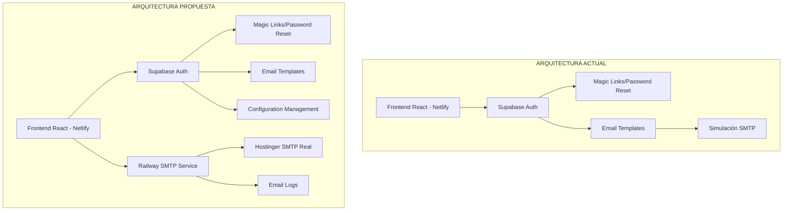
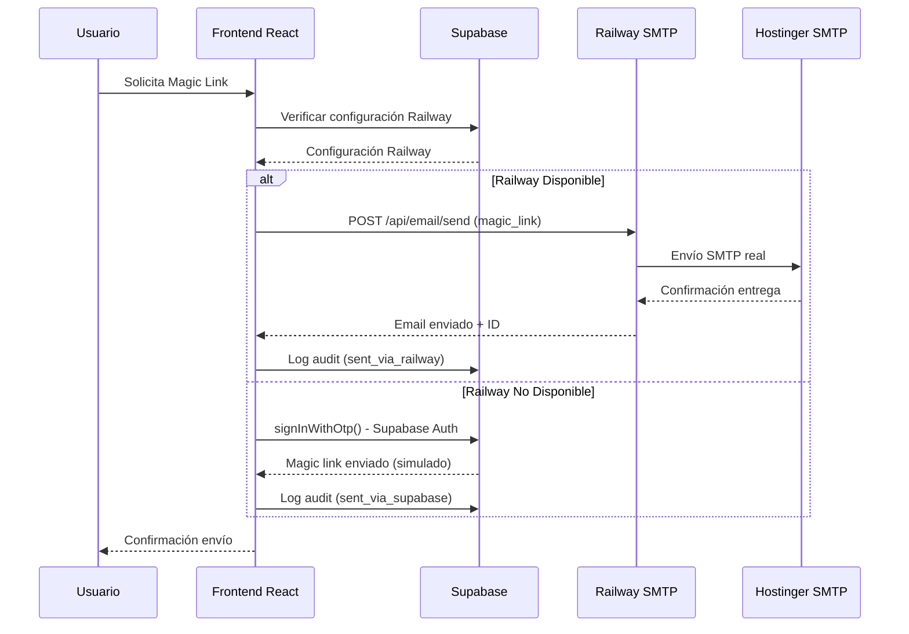
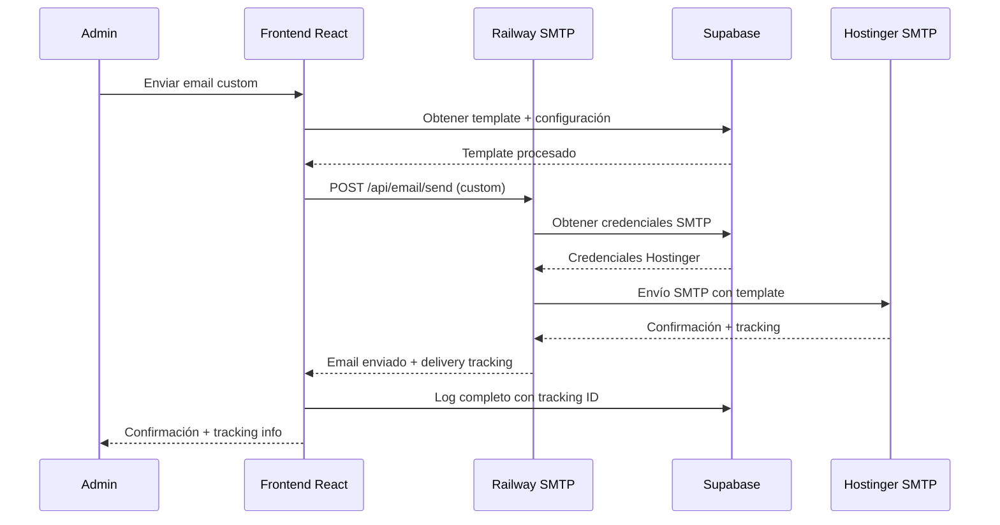
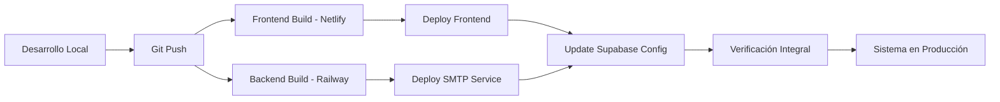

# 🚀 Integración Railway SMTP con Sistema Existente

## 📋 **Resumen Ejecutivo**

Este documento detalla cómo integrar un servicio SMTP dedicado usando Railway con el sistema de gestión de casos actual, manteniendo la arquitectura distribuida Netlify + Supabase + Railway para un sistema de emails robusto y escalable.

---

## 🏗️ **Arquitectura Propuesta**

### **Arquitectura Actual vs Propuesta**



### **Componentes del Sistema**

| Componente | Tecnología | Responsabilidad |
|------------|------------|-----------------|
| **Frontend** | React + Netlify | UI/UX, validaciones, integración |
| **Base de Datos** | Supabase PostgreSQL | Configuraciones, logs, templates |
| **Autenticación** | Supabase Auth | Magic links, password reset |
| **SMTP Service** | Railway + Node.js | Envío real de emails |
| **SMTP Provider** | Hostinger | Infraestructura de email |

---

## 🔧 **Integración Técnica Detallada**

### **1. Railway SMTP Service**

#### **Estructura del Servicio**
```
railway-email-service/
├── package.json
├── Dockerfile
├── railway.toml
├── src/
│   ├── app.js              # Express server principal
│   ├── emailService.js     # Lógica de envío SMTP
│   ├── templates.js        # Procesamiento de templates
│   ├── config.js           # Configuración SMTP
│   └── middleware/
│       ├── auth.js         # Validación de tokens
│       ├── rateLimit.js    # Rate limiting
│       └── logging.js      # Logging estructurado
├── templates/
│   ├── magic-link.hbs      # Template magic link
│   ├── password-reset.hbs  # Template reset password
│   ├── invitation.hbs      # Template invitación
│   └── confirmation.hbs    # Template confirmación
└── tests/
    ├── emailService.test.js
    └── integration.test.js
```

#### **API Endpoints**
```typescript
// POST /api/email/send
interface SendEmailRequest {
  email_type: 'magic_link' | 'password_reset' | 'invitation' | 'confirmation' | 'custom';
  recipient_email: string;
  template_variables: Record<string, any>;
  template_id?: string;
  priority?: 'low' | 'normal' | 'high';
}

// POST /api/email/bulk
interface BulkEmailRequest {
  emails: SendEmailRequest[];
  batch_size?: number;
  delay_ms?: number;
}

// GET /api/email/status/:email_id
interface EmailStatusResponse {
  id: string;
  status: 'pending' | 'sent' | 'delivered' | 'failed' | 'bounced';
  sent_at?: string;
  delivered_at?: string;
  error_message?: string;
}

// GET /api/email/health
interface HealthCheckResponse {
  status: 'healthy' | 'unhealthy';
  smtp_connection: boolean;
  database_connection: boolean;
  uptime: number;
  version: string;
}
```

### **2. Modificaciones en el Frontend React**

#### **Nuevo Hook para Railway Integration**
```typescript
// src/shared/hooks/useRailwayEmail.ts
import { useMutation, useQuery } from '@tanstack/react-query';
import { supabase } from '@/shared/lib/supabase';

interface RailwayEmailConfig {
  railway_api_url: string;
  railway_api_key: string;
  fallback_to_supabase: boolean;
  max_retries: number;
  timeout_ms: number;
}

export const useRailwayEmail = () => {
  const { showSuccess, showError } = useNotification();

  // Obtener configuración de Railway
  const { data: railwayConfig } = useQuery({
    queryKey: ['railway-email-config'],
    queryFn: async () => {
      const { data, error } = await supabase
        .rpc('get_railway_email_config');
      
      if (error) throw error;
      return data as RailwayEmailConfig;
    },
  });

  // Enviar email vía Railway
  const sendViaRailway = useMutation({
    mutationFn: async (params: SendEmailParams) => {
      if (!railwayConfig) throw new Error('Railway configuration not loaded');

      const response = await fetch(`${railwayConfig.railway_api_url}/api/email/send`, {
        method: 'POST',
        headers: {
          'Content-Type': 'application/json',
          'Authorization': `Bearer ${railwayConfig.railway_api_key}`,
          'X-Request-ID': crypto.randomUUID(),
        },
        body: JSON.stringify(params),
      });

      if (!response.ok) {
        const error = await response.json();
        throw new Error(error.message || 'Railway email service error');
      }

      const result = await response.json();
      
      // Log a Supabase para auditoría
      await supabase.from('email_logs').insert({
        email_type: params.email_type,
        recipient_email: params.recipient_email,
        status: 'sent_via_railway',
        railway_email_id: result.email_id,
        metadata: {
          template_variables: params.template_variables,
          railway_response: result,
          sent_via: 'railway_service'
        }
      });

      return result;
    },
    onSuccess: () => {
      showSuccess('Email enviado exitosamente vía Railway');
    },
    onError: async (error: any) => {
      showError('Error enviando email', error.message);
      
      // Fallback a Supabase Auth si está habilitado
      if (railwayConfig?.fallback_to_supabase) {
        console.log('Attempting fallback to Supabase Auth...');
        // Implementar fallback aquí
      }
    },
  });

  return {
    sendViaRailway,
    railwayConfig,
    isRailwayAvailable: !!railwayConfig?.railway_api_url,
  };
};
```

#### **Hook Unificado de Email**
```typescript
// src/shared/hooks/useSendEmail.ts - Modificaciones
export const useSendEmail = () => {
  const { sendViaRailway, isRailwayAvailable } = useRailwayEmail();
  const { sendMagicLink: sendSupabaseMagicLink } = useSupabaseEmail();

  // Estrategia de envío unificada
  const sendEmail = useMutation({
    mutationFn: async (params: SendEmailParams) => {
      // Preferir Railway si está disponible
      if (isRailwayAvailable) {
        try {
          return await sendViaRailway.mutateAsync(params);
        } catch (error) {
          console.error('Railway failed, falling back to Supabase:', error);
          
          // Fallback a Supabase para tipos compatibles
          if (['magic_link', 'password_reset', 'invitation'].includes(params.email_type)) {
            return await sendSupabaseMagicLink.mutateAsync(params);
          }
          
          throw error;
        }
      }

      // Usar Supabase como método principal si Railway no está disponible
      return await sendSupabaseMagicLink.mutateAsync(params);
    },
  });

  return {
    sendEmail,
    isRailwayAvailable,
    sendViaRailway,
    sendViaSupabase: sendSupabaseMagicLink,
  };
};
```

### **3. Configuración de Base de Datos**

#### **Nuevas Tablas para Railway Integration**
```sql
-- Configuraciones de Railway
INSERT INTO system_configurations (category, key, value, data_type, description, is_active, is_editable) VALUES
('railway_email', 'api_url', 'https://your-app.railway.app', 'string', 'URL del servicio Railway de emails', true, true),
('railway_email', 'api_key', 'your-secure-api-key', 'string', 'API Key para autenticación con Railway', true, true),
('railway_email', 'timeout_ms', '30000', 'number', 'Timeout en milisegundos para requests a Railway', true, true),
('railway_email', 'max_retries', '3', 'number', 'Máximo número de reintentos', true, true),
('railway_email', 'fallback_enabled', 'true', 'boolean', 'Habilitar fallback a Supabase Auth', true, true),
('railway_email', 'priority_threshold', 'high', 'string', 'Prioridad mínima para usar Railway', true, true),
('railway_email', 'rate_limit_per_minute', '60', 'number', 'Límite de emails por minuto vía Railway', true, true);

-- Logs extendidos para Railway
ALTER TABLE email_logs ADD COLUMN railway_email_id VARCHAR(255);
ALTER TABLE email_logs ADD COLUMN sent_via VARCHAR(50) DEFAULT 'supabase';
ALTER TABLE email_logs ADD COLUMN retry_count INTEGER DEFAULT 0;
ALTER TABLE email_logs ADD COLUMN delivery_status VARCHAR(50);
ALTER TABLE email_logs ADD COLUMN bounce_reason TEXT;

-- Índices para optimización
CREATE INDEX idx_email_logs_railway_id ON email_logs(railway_email_id);
CREATE INDEX idx_email_logs_sent_via ON email_logs(sent_via);
CREATE INDEX idx_email_logs_delivery_status ON email_logs(delivery_status);
```

#### **Función RPC para Configuración**
```sql
-- Función para obtener configuración de Railway de forma segura
CREATE OR REPLACE FUNCTION get_railway_email_config()
RETURNS JSON
LANGUAGE plpgsql
SECURITY DEFINER
AS $$
DECLARE
  config JSON;
BEGIN
  -- Solo usuarios autenticados pueden obtener configuración
  IF auth.uid() IS NULL THEN
    RAISE EXCEPTION 'Unauthorized';
  END IF;

  SELECT json_build_object(
    'railway_api_url', 
    (SELECT value FROM system_configurations 
     WHERE category = 'railway_email' AND key = 'api_url' AND is_active = true),
    'railway_api_key',
    (SELECT value FROM system_configurations 
     WHERE category = 'railway_email' AND key = 'api_key' AND is_active = true),
    'timeout_ms',
    (SELECT value::integer FROM system_configurations 
     WHERE category = 'railway_email' AND key = 'timeout_ms' AND is_active = true),
    'max_retries',
    (SELECT value::integer FROM system_configurations 
     WHERE category = 'railway_email' AND key = 'max_retries' AND is_active = true),
    'fallback_enabled',
    (SELECT value::boolean FROM system_configurations 
     WHERE category = 'railway_email' AND key = 'fallback_enabled' AND is_active = true)
  ) INTO config;

  RETURN config;
END;
$$;
```

### **4. Componente de Configuración Admin**

```typescript
// src/shared/components/RailwayEmailConfig.tsx
import React from 'react';
import { useForm } from 'react-hook-form';
import { useMutation, useQuery } from '@tanstack/react-query';
import { supabase } from '@/shared/lib/supabase';

interface RailwayConfigForm {
  api_url: string;
  api_key: string;
  timeout_ms: number;
  max_retries: number;
  fallback_enabled: boolean;
  rate_limit_per_minute: number;
}

export const RailwayEmailConfig: React.FC = () => {
  const { register, handleSubmit, setValue, watch } = useForm<RailwayConfigForm>();

  // Cargar configuración actual
  const { data: config, refetch } = useQuery({
    queryKey: ['railway-email-admin-config'],
    queryFn: async () => {
      const { data, error } = await supabase
        .from('system_configurations')
        .select('key, value, data_type')
        .eq('category', 'railway_email')
        .eq('is_active', true);

      if (error) throw error;

      const configObj: any = {};
      data.forEach(item => {
        const value = item.data_type === 'number' ? parseInt(item.value) :
                     item.data_type === 'boolean' ? item.value === 'true' :
                     item.value;
        configObj[item.key] = value;
      });

      return configObj as RailwayConfigForm;
    },
  });

  // Actualizar configuración
  const updateConfig = useMutation({
    mutationFn: async (formData: RailwayConfigForm) => {
      const updates = Object.entries(formData).map(([key, value]) => ({
        category: 'railway_email',
        key,
        value: value.toString(),
        data_type: typeof value === 'number' ? 'number' :
                   typeof value === 'boolean' ? 'boolean' : 'string'
      }));

      for (const update of updates) {
        const { error } = await supabase
          .from('system_configurations')
          .update({ value: update.value })
          .eq('category', update.category)
          .eq('key', update.key);

        if (error) throw error;
      }
    },
    onSuccess: () => {
      refetch();
    },
  });

  // Test de conexión
  const testConnection = useMutation({
    mutationFn: async () => {
      const formData = watch();
      const response = await fetch(`${formData.api_url}/api/email/health`, {
        headers: {
          'Authorization': `Bearer ${formData.api_key}`,
        },
      });

      if (!response.ok) {
        throw new Error(`HTTP ${response.status}: ${response.statusText}`);
      }

      return await response.json();
    },
  });

  React.useEffect(() => {
    if (config) {
      Object.entries(config).forEach(([key, value]) => {
        setValue(key as keyof RailwayConfigForm, value);
      });
    }
  }, [config, setValue]);

  return (
    <div className="space-y-6">
      <div className="bg-white shadow px-4 py-5 sm:rounded-lg sm:p-6">
        <h3 className="text-lg leading-6 font-medium text-gray-900 mb-4">
          Configuración Railway SMTP Service
        </h3>

        <form onSubmit={handleSubmit(data => updateConfig.mutate(data))} className="space-y-4">
          <div>
            <label className="block text-sm font-medium text-gray-700">
              URL del Servicio Railway
            </label>
            <input
              {...register('api_url', { required: true })}
              type="url"
              className="mt-1 block w-full border-gray-300 rounded-md shadow-sm"
              placeholder="https://your-app.railway.app"
            />
          </div>

          <div>
            <label className="block text-sm font-medium text-gray-700">
              API Key
            </label>
            <input
              {...register('api_key', { required: true })}
              type="password"
              className="mt-1 block w-full border-gray-300 rounded-md shadow-sm"
              placeholder="your-secure-api-key"
            />
          </div>

          <div className="grid grid-cols-2 gap-4">
            <div>
              <label className="block text-sm font-medium text-gray-700">
                Timeout (ms)
              </label>
              <input
                {...register('timeout_ms', { required: true, valueAsNumber: true })}
                type="number"
                className="mt-1 block w-full border-gray-300 rounded-md shadow-sm"
                placeholder="30000"
              />
            </div>

            <div>
              <label className="block text-sm font-medium text-gray-700">
                Max Reintentos
              </label>
              <input
                {...register('max_retries', { required: true, valueAsNumber: true })}
                type="number"
                className="mt-1 block w-full border-gray-300 rounded-md shadow-sm"
                placeholder="3"
              />
            </div>
          </div>

          <div className="flex items-center">
            <input
              {...register('fallback_enabled')}
              type="checkbox"
              className="h-4 w-4 text-indigo-600 border-gray-300 rounded"
            />
            <label className="ml-2 block text-sm text-gray-900">
              Habilitar fallback a Supabase Auth
            </label>
          </div>

          <div className="flex space-x-3">
            <button
              type="submit"
              disabled={updateConfig.isPending}
              className="bg-indigo-600 text-white px-4 py-2 rounded-md hover:bg-indigo-700 disabled:opacity-50"
            >
              {updateConfig.isPending ? 'Guardando...' : 'Guardar Configuración'}
            </button>

            <button
              type="button"
              onClick={() => testConnection.mutate()}
              disabled={testConnection.isPending}
              className="bg-green-600 text-white px-4 py-2 rounded-md hover:bg-green-700 disabled:opacity-50"
            >
              {testConnection.isPending ? 'Probando...' : 'Test Conexión'}
            </button>
          </div>
        </form>

        {testConnection.data && (
          <div className="mt-4 p-4 bg-green-50 rounded-md">
            <h4 className="text-sm font-medium text-green-800">✅ Conexión Exitosa</h4>
            <pre className="mt-2 text-xs text-green-700">
              {JSON.stringify(testConnection.data, null, 2)}
            </pre>
          </div>
        )}

        {testConnection.error && (
          <div className="mt-4 p-4 bg-red-50 rounded-md">
            <h4 className="text-sm font-medium text-red-800">❌ Error de Conexión</h4>
            <p className="mt-2 text-sm text-red-700">
              {testConnection.error.message}
            </p>
          </div>
        )}
      </div>
    </div>
  );
};
```

---

## 🔄 **Flujo de Integración Completo**

### **1. Envío de Magic Link**


### **2. Envío de Email Custom**


---

## 📦 **Implementación Paso a Paso**

### **Fase 1: Preparación (1-2 días)**

#### **1.1 Configurar Railway Service**
```bash
# Crear servicio en Railway
railway login
railway new
railway link

# Configurar variables de entorno
railway variables set SMTP_HOST=smtp.hostinger.com
railway variables set SMTP_PORT=465
railway variables set SMTP_SECURE=true
railway variables set SMTP_USER=case-management@andrejgalzate.com
railway variables set SMTP_PASS=your-smtp-password
railway variables set API_KEY=your-secure-api-key
railway variables set SUPABASE_URL=your-supabase-url
railway variables set SUPABASE_SERVICE_KEY=your-service-key

# Deploy inicial
railway up
```

#### **1.2 Actualizar Base de Datos**
```sql
-- Ejecutar en Supabase SQL Editor
-- Agregar configuraciones Railway
-- Crear función get_railway_email_config()
-- Actualizar tabla email_logs
-- Crear índices necesarios
```

### **Fase 2: Backend Railway (2-3 días)**

#### **2.1 Desarrollar SMTP Service**
- Configurar Express.js server
- Implementar autenticación con API Key
- Crear servicios de envío SMTP
- Configurar rate limiting
- Implementar logging estructurado
- Crear health checks

#### **2.2 Testing del Service**
```bash
# Test local
npm test

# Test en Railway
curl https://your-app.railway.app/api/email/health \
  -H "Authorization: Bearer your-api-key"
```

### **Fase 3: Frontend Integration (2-3 días)**

#### **3.1 Implementar Hooks**
- `useRailwayEmail.ts` para comunicación con Railway
- Modificar `useSendEmail.ts` para estrategia unificada
- Agregar manejo de errores y fallbacks

#### **3.2 Crear Componentes Admin**
- Panel de configuración Railway
- Test de conexión
- Monitoreo de health status
- Logs de email unificados

#### **3.3 Actualizar UI Existente**
- Agregar indicador de servicio Railway activo
- Mostrar método de envío en logs
- Mejorar feedback de entrega

### **Fase 4: Testing y Deployment (2-3 días)**

#### **4.1 Testing Integral**
- Test de envío vía Railway
- Test de fallback a Supabase
- Test de configuración admin
- Test de load/stress

#### **4.2 Deployment Producción**
- Deploy Railway service
- Actualizar configuraciones en Supabase
- Deploy frontend en Netlify
- Configurar monitoreo

---

## � **Despliegue en Producción**

### **📋 Visión General del Despliegue**

El despliegue en producción implica coordinar tres servicios principales:
1. **Frontend React** → Netlify (sin cambios en el proceso actual)
2. **Backend SMTP** → Railway (nuevo servicio)
3. **Base de Datos** → Supabase (configuraciones adicionales)

### **🔄 Flujo de Despliegue Completo**



---

### **🌐 Despliegue Frontend en Netlify**

#### **1. Configuración Netlify (Sin Cambios)**

El frontend se despliega igual que siempre en Netlify, pero con nuevas variables de entorno:

```bash
# Variables de entorno en Netlify Dashboard
VITE_SUPABASE_URL=https://your-project.supabase.co
VITE_SUPABASE_ANON_KEY=your-anon-key
VITE_RAILWAY_ENABLED=true  # Nueva variable
VITE_ENVIRONMENT=production
```

#### **2. Build Configuration (netlify.toml)**

```toml
# netlify.toml - Sin cambios en la configuración base
[build]
  publish = "dist"
  command = "npm run build"

[build.environment]
  NODE_VERSION = "18"

[[redirects]]
  from = "/*"
  to = "/index.html"
  status = 200

# Headers para seguridad (Railway CORS)
[[headers]]
  for = "/*"
  [headers.values]
    X-Frame-Options = "DENY"
    X-Content-Type-Options = "nosniff"
    Referrer-Policy = "strict-origin-when-cross-origin"
    Content-Security-Policy = "default-src 'self'; connect-src 'self' https://*.supabase.co https://*.railway.app; img-src 'self' data: https:; style-src 'self' 'unsafe-inline'"
```

#### **3. Deploy Script Automatizado**

```bash
#!/bin/bash
# scripts/deploy-frontend.sh

echo "🚀 Deploying Frontend to Netlify..."

# 1. Verificar que estemos en la rama main
current_branch=$(git branch --show-current)
if [ "$current_branch" != "main" ]; then
  echo "❌ Error: Debe estar en la rama 'main' para deployment"
  exit 1
fi

# 2. Verificar que no hay cambios sin commit
if [ -n "$(git status --porcelain)" ]; then
  echo "❌ Error: Hay cambios sin commit. Commit primero."
  exit 1
fi

# 3. Ejecutar tests
echo "🧪 Running tests..."
npm test -- --watchAll=false

if [ $? -ne 0 ]; then
  echo "❌ Tests fallaron. Cancelando deployment."
  exit 1
fi

# 4. Build local para verificar
echo "🔨 Building for production..."
npm run build

if [ $? -ne 0 ]; then
  echo "❌ Build falló. Cancelando deployment."
  exit 1
fi

# 5. Deploy automático via Git push
echo "📤 Pushing to main branch (triggers Netlify deploy)..."
git push origin main

echo "✅ Frontend deployment iniciado en Netlify"
echo "🔗 Monitorea el progreso en: https://app.netlify.com"
```

#### **4. Verificación Post-Deploy Frontend**

```bash
#!/bin/bash
# scripts/verify-frontend-deploy.sh

NETLIFY_URL="https://case-management-ctl.netlify.app"

echo "🔍 Verificando deployment del frontend..."

# 1. Verificar que el sitio responde
http_code=$(curl -s -o /dev/null -w "%{http_code}" $NETLIFY_URL)
if [ $http_code -eq 200 ]; then
  echo "✅ Frontend respondiendo correctamente"
else
  echo "❌ Frontend no responde. HTTP: $http_code"
  exit 1
fi

# 2. Verificar que la app carga
health_check=$(curl -s "$NETLIFY_URL/api/health" | jq -r '.status' 2>/dev/null || echo "fail")
if [ "$health_check" = "ok" ]; then
  echo "✅ Health check passed"
else
  echo "⚠️  Health check endpoint not available (expected for React SPA)"
fi

# 3. Verificar variables de entorno (via console)
echo "🔧 Verificar manualmente en browser console:"
echo "   console.log('Supabase URL:', import.meta.env.VITE_SUPABASE_URL)"
echo "   console.log('Railway Enabled:', import.meta.env.VITE_RAILWAY_ENABLED)"

echo "✅ Verificación del frontend completa"
```

---

### **🚂 Despliegue Backend SMTP en Railway**

#### **1. Preparación del Repositorio Backend**

```bash
# Crear repositorio separado para el servicio SMTP
mkdir case-management-smtp-service
cd case-management-smtp-service

# Inicializar proyecto
npm init -y
git init
git remote add origin https://github.com/your-org/case-management-smtp-service.git
```

#### **2. Estructura del Proyecto Railway**

```
case-management-smtp-service/
├── package.json
├── Dockerfile
├── railway.toml              # Configuración Railway
├── .gitignore
├── .env.example
├── README.md
├── src/
│   ├── app.js               # Express server
│   ├── config/
│   │   ├── database.js      # Conexión Supabase
│   │   ├── smtp.js          # Config SMTP
│   │   └── security.js      # Auth & validation
│   ├── services/
│   │   ├── emailService.js  # Lógica envío
│   │   ├── templateService.js
│   │   └── logService.js
│   ├── routes/
│   │   ├── health.js        # Health checks
│   │   ├── email.js         # Email endpoints
│   │   └── admin.js         # Admin endpoints
│   └── middleware/
│       ├── auth.js
│       ├── validation.js
│       └── rateLimit.js
├── templates/
│   ├── magic-link.hbs
│   ├── password-reset.hbs
│   └── invitation.hbs
├── tests/
│   ├── health.test.js
│   ├── email.test.js
│   └── integration.test.js
└── scripts/
    ├── deploy.sh
    └── verify.sh
```

#### **3. Configuración Railway (railway.toml)**

```toml
# railway.toml
[build]
  builder = "NIXPACKS"
  buildCommand = "npm install && npm run build"

[deploy]
  startCommand = "npm start"
  healthcheckPath = "/api/health"
  healthcheckTimeout = 30
  restartPolicyType = "ON_FAILURE"
  restartPolicyMaxRetries = 3

[environments.production]
  variables = [
    "NODE_ENV=production",
    "PORT=3000"
  ]

# Variables secretas se configuran via Railway Dashboard
```

#### **4. Dockerfile Optimizado**

```dockerfile
# Dockerfile
FROM node:18-alpine

# Instalar dependencias del sistema
RUN apk add --no-cache \
    dumb-init \
    curl

# Crear usuario no-root
RUN addgroup -g 1001 -S nodejs
RUN adduser -S emailservice -u 1001

# Configurar directorio de trabajo
WORKDIR /app

# Copiar archivos de dependencias
COPY package*.json ./
RUN npm ci --only=production && npm cache clean --force

# Copiar código fuente
COPY --chown=emailservice:nodejs . .

# Cambiar a usuario no-root
USER emailservice

# Health check
HEALTHCHECK --interval=30s --timeout=3s --start-period=5s --retries=3 \
  CMD curl -f http://localhost:3000/api/health || exit 1

# Exponer puerto
EXPOSE 3000

# Comando de inicio
ENTRYPOINT ["dumb-init", "--"]
CMD ["npm", "start"]
```

#### **5. Deploy Script Railway**

```bash
#!/bin/bash
# scripts/deploy-railway.sh

echo "🚂 Deploying SMTP Service to Railway..."

# 1. Verificar Railway CLI
if ! command -v railway &> /dev/null; then
  echo "❌ Railway CLI no está instalado. Instalando..."
  npm install -g @railway/cli
fi

# 2. Login a Railway
echo "🔐 Logging into Railway..."
railway login

# 3. Verificar proyecto linkado
if [ ! -f ".railway/project" ]; then
  echo "❌ Proyecto no está linkado. Ejecuta: railway link"
  exit 1
fi

# 4. Configurar variables de entorno
echo "🔧 Setting environment variables..."

# Variables desde archivo .env.production
if [ -f ".env.production" ]; then
  while IFS='=' read -r key value; do
    # Ignorar comentarios y líneas vacías
    if [[ $key =~ ^[A-Z] ]]; then
      echo "Setting $key..."
      railway variables set "$key=$value"
    fi
  done < .env.production
else
  echo "❌ Archivo .env.production no encontrado"
  exit 1
fi

# 5. Deploy
echo "🚀 Starting deployment..."
railway up --detach

# 6. Obtener URL del servicio
SERVICE_URL=$(railway status --json | jq -r '.deployments[0].url')
echo "✅ Deployment completed!"
echo "🔗 Service URL: $SERVICE_URL"

# 7. Verificar health check
echo "🏥 Checking service health..."
sleep 30  # Esperar que el servicio inicie
curl -f "$SERVICE_URL/api/health" || echo "⚠️  Health check pendiente"

echo "✅ Railway deployment process completed!"
```

#### **6. Variables de Entorno Railway**

```bash
# .env.production (para reference, las variables se configuran via Railway Dashboard)

# SMTP Configuration
SMTP_HOST=smtp.hostinger.com
SMTP_PORT=465
SMTP_SECURE=true
SMTP_USER=case-management@andrejgalzate.com
SMTP_PASS=your-hostinger-smtp-password

# Security
API_KEY=your-secure-api-key-32-chars
ENCRYPTION_KEY=your-encryption-key-32-chars
JWT_SECRET=your-jwt-secret

# Supabase Connection
SUPABASE_URL=https://your-project.supabase.co
SUPABASE_SERVICE_KEY=your-service-role-key
SUPABASE_ANON_KEY=your-anon-key

# Service Configuration
NODE_ENV=production
PORT=3000
RATE_LIMIT_WINDOW_MS=60000
RATE_LIMIT_MAX_REQUESTS=60
CORS_ORIGINS=https://case-management-ctl.netlify.app,https://your-project.supabase.co

# Monitoring
LOG_LEVEL=info
HEALTH_CHECK_INTERVAL=30000
```

#### **7. Configuración de Variables en Railway Dashboard**

```bash
#!/bin/bash
# scripts/setup-railway-vars.sh

echo "🔧 Configurando variables en Railway..."

# Variables de SMTP
railway variables set SMTP_HOST=smtp.hostinger.com
railway variables set SMTP_PORT=465
railway variables set SMTP_SECURE=true
railway variables set SMTP_USER=case-management@andrejgalzate.com
railway variables set SMTP_PASS="$HOSTINGER_SMTP_PASSWORD"

# Security keys (generar automáticamente)
API_KEY=$(openssl rand -hex 32)
ENCRYPTION_KEY=$(openssl rand -hex 32)
JWT_SECRET=$(openssl rand -hex 32)

railway variables set API_KEY="$API_KEY"
railway variables set ENCRYPTION_KEY="$ENCRYPTION_KEY"
railway variables set JWT_SECRET="$JWT_SECRET"

# Supabase
railway variables set SUPABASE_URL="$SUPABASE_URL"
railway variables set SUPABASE_SERVICE_KEY="$SUPABASE_SERVICE_KEY"

# Service config
railway variables set NODE_ENV=production
railway variables set PORT=3000
railway variables set CORS_ORIGINS="https://case-management-ctl.netlify.app"

echo "✅ Variables configuradas. Guardadas en .env.backup:"
echo "API_KEY=$API_KEY" > .env.backup
echo "ENCRYPTION_KEY=$ENCRYPTION_KEY" >> .env.backup
echo "JWT_SECRET=$JWT_SECRET" >> .env.backup

echo "📝 IMPORTANTE: Guarda estas keys de forma segura!"
```

---

### **🔄 Workflow de Despliegue Integrado**

#### **1. CI/CD con GitHub Actions**

```yaml
# .github/workflows/deploy-production.yml
name: Deploy to Production

on:
  push:
    branches: [ main ]
  workflow_dispatch:

jobs:
  deploy-frontend:
    runs-on: ubuntu-latest
    steps:
      - uses: actions/checkout@v3
      
      - name: Setup Node.js
        uses: actions/setup-node@v3
        with:
          node-version: '18'
          cache: 'npm'
      
      - name: Install dependencies
        run: npm ci
      
      - name: Run tests
        run: npm test -- --watchAll=false
      
      - name: Build frontend
        run: npm run build
        env:
          VITE_SUPABASE_URL: ${{ secrets.VITE_SUPABASE_URL }}
          VITE_SUPABASE_ANON_KEY: ${{ secrets.VITE_SUPABASE_ANON_KEY }}
          VITE_RAILWAY_ENABLED: true
          VITE_ENVIRONMENT: production
      
      # Netlify se despliega automáticamente via Git integration
      - name: Trigger Netlify Deploy
        run: echo "✅ Frontend build successful, Netlify will auto-deploy"

  deploy-backend:
    runs-on: ubuntu-latest
    needs: deploy-frontend
    steps:
      - uses: actions/checkout@v3
        with:
          repository: your-org/case-management-smtp-service
          token: ${{ secrets.GH_TOKEN }}
      
      - name: Setup Node.js
        uses: actions/setup-node@v3
        with:
          node-version: '18'
          cache: 'npm'
      
      - name: Install Railway CLI
        run: npm install -g @railway/cli
      
      - name: Deploy to Railway
        run: railway up --detach
        env:
          RAILWAY_TOKEN: ${{ secrets.RAILWAY_TOKEN }}

  verify-deployment:
    runs-on: ubuntu-latest
    needs: [deploy-frontend, deploy-backend]
    steps:
      - name: Verify Frontend
        run: |
          curl -f https://case-management-ctl.netlify.app || exit 1
          echo "✅ Frontend is live"
      
      - name: Verify Backend
        run: |
          curl -f ${{ secrets.RAILWAY_SERVICE_URL }}/api/health || exit 1
          echo "✅ Backend is live"
      
      - name: Integration Test
        run: |
          # Test email sending integration
          curl -X POST "${{ secrets.RAILWAY_SERVICE_URL }}/api/email/send" \
            -H "Authorization: Bearer ${{ secrets.RAILWAY_API_KEY }}" \
            -H "Content-Type: application/json" \
            -d '{"email_type":"test","recipient_email":"test@example.com","template_variables":{}}' \
            || echo "⚠️  Integration test needs manual verification"
```

#### **2. Script de Despliegue Manual Completo**

```bash
#!/bin/bash
# scripts/deploy-production-complete.sh

set -e  # Exit on any error

echo "🚀 DESPLIEGUE COMPLETO A PRODUCCIÓN"
echo "=================================="

# Verificaciones previas
echo "🔍 Verificaciones previas..."

# 1. Verificar que estamos en main
if [ "$(git branch --show-current)" != "main" ]; then
  echo "❌ Debe estar en la rama 'main'"
  exit 1
fi

# 2. Verificar que no hay cambios pendientes
if [ -n "$(git status --porcelain)" ]; then
  echo "❌ Hay cambios sin commit"
  exit 1
fi

# 3. Verificar dependencias
if ! command -v railway &> /dev/null; then
  echo "❌ Railway CLI requerido. Instalando..."
  npm install -g @railway/cli
fi

echo "✅ Verificaciones previas completadas"

# FASE 1: Desplegar Backend SMTP a Railway
echo ""
echo "📡 FASE 1: Desplegando Backend SMTP a Railway..."
echo "================================================"

# Cambiar al directorio del backend
if [ -d "../case-management-smtp-service" ]; then
  cd ../case-management-smtp-service
else
  echo "❌ Directorio del backend no encontrado"
  exit 1
fi

# Login a Railway
railway login

# Deploy backend
echo "🚂 Deploying SMTP service..."
railway up --detach

# Obtener URL del servicio
RAILWAY_URL=$(railway status --json | jq -r '.deployments[0].url' 2>/dev/null || echo "")
if [ -z "$RAILWAY_URL" ]; then
  echo "⚠️  No se pudo obtener URL automáticamente. Verificar manualmente."
  RAILWAY_URL="https://case-management-smtp-production.up.railway.app"
fi

echo "✅ Backend desplegado en: $RAILWAY_URL"

# Volver al directorio frontend
cd ../case-management-react

# FASE 2: Actualizar configuración en Supabase
echo ""
echo "🗄️  FASE 2: Actualizando configuración Supabase..."
echo "==================================================="

# Crear script SQL temporal
cat > /tmp/update-railway-config.sql << EOF
-- Actualizar configuración Railway en producción
UPDATE system_configurations 
SET value = '$RAILWAY_URL' 
WHERE category = 'railway_email' AND key = 'api_url';

-- Verificar configuración
SELECT category, key, value 
FROM system_configurations 
WHERE category = 'railway_email';
EOF

echo "📝 Archivo SQL creado. Ejecutar manualmente en Supabase SQL Editor:"
echo "   File: /tmp/update-railway-config.sql"

# FASE 3: Desplegar Frontend a Netlify
echo ""
echo "🌐 FASE 3: Desplegando Frontend a Netlify..."
echo "============================================="

# Tests
echo "🧪 Ejecutando tests..."
npm test -- --watchAll=false

# Build
echo "🔨 Building para producción..."
npm run build

# Push para trigger Netlify deploy
echo "📤 Triggering Netlify deployment..."
git push origin main

echo "✅ Frontend deployment iniciado"

# FASE 4: Verificaciones
echo ""
echo "🔍 FASE 4: Verificaciones finales..."
echo "===================================="

echo "⏳ Esperando 60 segundos para que los servicios inicien..."
sleep 60

# Verificar backend
echo "🔍 Verificando backend..."
if curl -f "$RAILWAY_URL/api/health" >/dev/null 2>&1; then
  echo "✅ Backend Railway respondiendo"
else
  echo "⚠️  Backend aún inicializando o requiere verificación manual"
fi

# Verificar frontend
echo "🔍 Verificando frontend..."
if curl -f "https://case-management-ctl.netlify.app" >/dev/null 2>&1; then
  echo "✅ Frontend Netlify respondiendo"
else
  echo "⚠️  Frontend aún deployando o requiere verificación manual"
fi

# Resumen final
echo ""
echo "🎉 DESPLIEGUE COMPLETADO"
echo "========================"
echo "🌐 Frontend: https://case-management-ctl.netlify.app"
echo "📡 Backend:  $RAILWAY_URL"
echo "🗄️  Base de Datos: Supabase (sin cambios)"
echo ""
echo "📋 TAREAS MANUALES PENDIENTES:"
echo "1. Ejecutar SQL en Supabase para actualizar Railway URL"
echo "2. Verificar en admin panel que Railway esté conectado"
echo "3. Enviar email de prueba para confirmar integración"
echo "4. Verificar logs de email en ambos sistemas"
echo ""
echo "✅ Despliegue de producción completo!"
```

#### **3. Verificación Post-Despliegue**

```bash
#!/bin/bash
# scripts/verify-production-deployment.sh

echo "🔍 VERIFICACIÓN INTEGRAL DE PRODUCCIÓN"
echo "======================================"

FRONTEND_URL="https://case-management-ctl.netlify.app"
BACKEND_URL="https://case-management-smtp-production.up.railway.app"

# 1. Verificar Frontend
echo "🌐 Verificando Frontend..."
frontend_status=$(curl -s -o /dev/null -w "%{http_code}" $FRONTEND_URL)
if [ $frontend_status -eq 200 ]; then
  echo "✅ Frontend respondiendo (HTTP $frontend_status)"
else
  echo "❌ Frontend no responde (HTTP $frontend_status)"
fi

# 2. Verificar Backend
echo "📡 Verificando Backend..."
backend_health=$(curl -s "$BACKEND_URL/api/health" | jq -r '.status' 2>/dev/null || echo "error")
if [ "$backend_health" = "healthy" ]; then
  echo "✅ Backend healthy"
else
  echo "❌ Backend no healthy: $backend_health"
fi

# 3. Test de integración básico
echo "🔗 Test de integración..."
# Aquí podrías agregar un test real de envío de email de prueba

# 4. Verificar CORS
echo "🔒 Verificando CORS..."
cors_response=$(curl -s -X OPTIONS "$BACKEND_URL/api/email/send" \
  -H "Origin: $FRONTEND_URL" \
  -H "Access-Control-Request-Method: POST" \
  -H "Access-Control-Request-Headers: Content-Type,Authorization" \
  -w "%{http_code}" -o /dev/null)

if [ $cors_response -eq 200 ] || [ $cors_response -eq 204 ]; then
  echo "✅ CORS configurado correctamente"
else
  echo "⚠️  Verificar configuración CORS (HTTP $cors_response)"
fi

echo ""
echo "📊 RESUMEN DE VERIFICACIÓN:"
echo "- Frontend: $([ $frontend_status -eq 200 ] && echo "✅ OK" || echo "❌ FAIL")"
echo "- Backend: $([ "$backend_health" = "healthy" ] && echo "✅ OK" || echo "❌ FAIL")"
echo "- CORS: $([ $cors_response -eq 200 ] || [ $cors_response -eq 204 ] && echo "✅ OK" || echo "⚠️  CHECK")"
```

---

### **📝 Checklist de Despliegue**

#### **Pre-Despliegue**
- [ ] Tests pasando en local
- [ ] Build exitoso en local
- [ ] Credenciales SMTP verificadas
- [ ] Variables de entorno preparadas
- [ ] Backup de configuración actual

#### **Durante Despliegue**
- [ ] Backend Railway desplegado
- [ ] Health check backend OK
- [ ] Frontend Netlify desplegado
- [ ] Configuración Supabase actualizada
- [ ] CORS configurado correctamente

#### **Post-Despliegue**
- [ ] Frontend accesible
- [ ] Backend health check passing
- [ ] Integración frontend-backend funcional
- [ ] Test de envío de email
- [ ] Logs funcionando
- [ ] Monitoreo activo

#### **Rollback Plan**
- [ ] Script de rollback preparado
- [ ] Configuración anterior respaldada
- [ ] Plan de comunicación a usuarios
- [ ] Tiempo de ventana de mantenimiento

---

## �🚨 **Consideraciones de Seguridad**

### **Autenticación y Autorización**
```typescript
// Middleware de autenticación en Railway
const authenticateApiKey = (req, res, next) => {
  const authHeader = req.headers.authorization;
  const token = authHeader?.split(' ')[1];

  if (!token || token !== process.env.API_KEY) {
    return res.status(401).json({ error: 'Unauthorized' });
  }

  next();
};

// Rate limiting por IP y API key
const createRateLimiter = rateLimit({
  windowMs: 1 * 60 * 1000, // 1 minuto
  max: 60, // 60 requests por minuto
  message: 'Too many email requests',
  standardHeaders: true,
  legacyHeaders: false,
});
```

### **Validación de Datos**
```typescript
// Validación de email request
const validateEmailRequest = (req, res, next) => {
  const { email_type, recipient_email, template_variables } = req.body;

  // Validar email
  if (!isValidEmail(recipient_email)) {
    return res.status(400).json({ error: 'Invalid email format' });
  }

  // Validar tipo de email
  const allowedTypes = ['magic_link', 'password_reset', 'invitation', 'confirmation', 'custom'];
  if (!allowedTypes.includes(email_type)) {
    return res.status(400).json({ error: 'Invalid email type' });
  }

  // Sanitizar variables
  req.body.template_variables = sanitizeObject(template_variables || {});

  next();
};
```

### **Encriptación de Credenciales**
```typescript
// Encriptar credenciales SMTP
const encryptCredentials = (credentials) => {
  const algorithm = 'aes-256-gcm';
  const key = crypto.scryptSync(process.env.ENCRYPTION_KEY, 'salt', 32);
  const iv = crypto.randomBytes(16);
  
  const cipher = crypto.createCipher(algorithm, key);
  cipher.setAAD(Buffer.from('smtp-credentials'));
  
  let encrypted = cipher.update(JSON.stringify(credentials), 'utf8', 'hex');
  encrypted += cipher.final('hex');
  
  const authTag = cipher.getAuthTag();
  
  return {
    encrypted,
    iv: iv.toString('hex'),
    authTag: authTag.toString('hex')
  };
};
```

---

## 📊 **Monitoreo y Métricas**

### **Dashboard de Métricas**
```typescript
// Métricas a trackear
interface EmailMetrics {
  total_sent: number;
  sent_via_railway: number;
  sent_via_supabase: number;
  failed_attempts: number;
  average_delivery_time: number;
  bounce_rate: number;
  open_rate: number; // Si se implementa tracking
  success_rate: number;
  railway_uptime: number;
}

// Query para métricas
const getEmailMetrics = async (timeframe: '24h' | '7d' | '30d') => {
  const { data, error } = await supabase
    .from('email_logs')
    .select('*')
    .gte('created_at', getTimeframeStart(timeframe));

  if (error) throw error;

  return calculateMetrics(data);
};
```

### **Alertas y Notificaciones**
```typescript
// Sistema de alertas
interface AlertConfig {
  railway_service_down: {
    threshold: 3, // fallos consecutivos
    notification: ['admin@example.com', 'webhook_url'];
  };
  high_failure_rate: {
    threshold: 0.1, // 10% de fallos
    window: '1h';
    notification: ['admin@example.com'];
  };
  smtp_quota_reached: {
    threshold: 0.9, // 90% del límite diario
    notification: ['admin@example.com'];
  };
}
```

---

## 💰 **Costos y Recursos**

### **Estimación de Costos**

| Servicio | Costo Mensual | Descripción |
|----------|---------------|-------------|
| **Railway** | $5-20 USD | Hosting del servicio SMTP |
| **Hostinger SMTP** | Incluido | Ya disponible en plan actual |
| **Supabase** | Actual | Sin cambios en el plan |
| **Netlify** | Actual | Sin cambios en el plan |
| **Total Incremental** | **$5-20 USD** | Solo Railway hosting |

### **Recursos de Desarrollo**

| Fase | Tiempo Estimado | Recursos |
|------|-----------------|----------|
| **Configuración Railway** | 1-2 días | 1 developer |
| **Backend SMTP Service** | 2-3 días | 1 developer |
| **Frontend Integration** | 2-3 días | 1 developer |
| **Testing & Deployment** | 2-3 días | 1 developer + QA |
| **Total** | **7-11 días** | **1 developer full-time** |

---

## ✅ **Beneficios de la Implementación**

### **Técnicos**
- ✅ **Envío Real de Emails**: SMTP funcional con Hostinger
- ✅ **Escalabilidad**: Servicio dedicado para emails
- ✅ **Reliability**: Fallback automático a Supabase Auth
- ✅ **Monitoring**: Tracking completo de deliverability
- ✅ **Flexibilidad**: Templates customizables y emails transaccionales

### **Operacionales**
- ✅ **Mantenimiento Separado**: El servicio de emails no afecta el frontend
- ✅ **Deploy Independiente**: Updates sin afectar Netlify
- ✅ **Configuración Centralizada**: Admin panel para Railway config
- ✅ **Logs Unificados**: Auditoría completa en Supabase

### **De Negocio**
- ✅ **Cumplimiento**: Emails reales para notificaciones legales
- ✅ **Profesionalismo**: Emails desde dominio corporativo
- ✅ **Confiabilidad**: Sistema robusto con fallbacks
- ✅ **Costo-Efectivo**: Solo $5-20/mes adicionales

---

## 🔧 **Implementación Inmediata**

### **Para Empezar Hoy**

1. **Crear cuenta Railway** (5 min)
2. **Configurar repositorio** del servicio SMTP (30 min)
3. **Deploy inicial** en Railway (15 min)
4. **Agregar configuraciones** en Supabase (15 min)
5. **Test básico** de conectividad (10 min)

### **Scripts de Deployment**

```bash
#!/bin/bash
# deploy-railway-service.sh

echo "🚀 Deploying Railway SMTP Service..."

# 1. Clonar template
git clone https://github.com/your-org/railway-smtp-template.git
cd railway-smtp-template

# 2. Configurar Railway
railway login
railway new -n "case-management-smtp"
railway link

# 3. Configurar variables
railway variables set SMTP_HOST=smtp.hostinger.com
railway variables set SMTP_PORT=465
railway variables set SMTP_SECURE=true
railway variables set SMTP_USER=case-management@andrejgalzate.com
railway variables set SMTP_PASS=$HOSTINGER_SMTP_PASSWORD
railway variables set API_KEY=$(openssl rand -hex 32)
railway variables set SUPABASE_URL=$SUPABASE_URL
railway variables set SUPABASE_SERVICE_KEY=$SUPABASE_SERVICE_KEY

# 4. Deploy
railway up

echo "✅ Railway service deployed successfully!"
echo "📝 Save this API Key: $(railway variables get API_KEY)"
```

---

## 📞 **Soporte y Mantenimiento**

### **Documentación Técnica**
- 📚 **API Documentation**: Swagger/OpenAPI specs
- 🔧 **Deployment Guide**: Step-by-step railway setup
- 🧪 **Testing Guide**: Unit & integration tests
- 🚨 **Troubleshooting**: Common issues and solutions

### **Monitoreo Continuo**
- 📊 **Health Checks**: Automated service monitoring
- 📈 **Performance Metrics**: Response times, throughput
- 🚨 **Error Tracking**: Structured logging and alerts
- 📧 **Delivery Analytics**: Success rates, bounce tracking

---

## 🎯 **Conclusión**

La integración del servicio Railway SMTP con tu sistema actual es **técnicamente viable** y **costo-efectiva**. Mantiene la arquitectura distribuida existente mientras añade capacidades reales de envío de emails.

### **Próximos Pasos Inmediatos**
1. ✅ **Aprobación del presupuesto** ($5-20 USD/mes)
2. ✅ **Crear cuenta Railway** y repositorio del servicio
3. ✅ **Implementar el servicio SMTP** (7-11 días)
4. ✅ **Integrar con el frontend** existente
5. ✅ **Testing y deployment** en producción

### **Resultado Final**
Un sistema de emails completamente funcional que mantiene toda tu arquitectura actual y añade las capacidades que necesitas, con **mínimo riesgo** y **máximo beneficio**.

---

**📄 Documento generado el:** ${new Date().toLocaleDateString('es-MX')}  
**📊 Versión:** 1.0.0  
**⚡ Estado:** Listo para implementación  
**🔄 Última actualización:** Integración completa Railway + Sistema Actual
