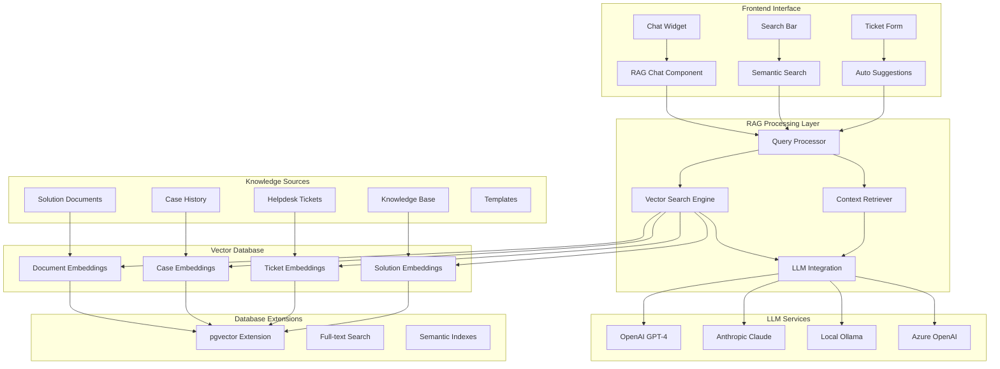

# 🤖 Sistema RAG - Arquitectura y Implementación

## 📊 Diagrama de Arquitectura



## 🎯 Objetivos del Sistema

### Objetivos Principales

1. **Respuesta Automática**: Bot que responde consultas usando conocimiento existente
2. **Búsqueda Inteligente**: Encontrar información relevante semánticamente
3. **Sugerencias Contextuales**: Proponer soluciones basadas en casos similares
4. **Asistencia en Tiempo Real**: Ayuda durante la creación de tickets/casos

### Casos de Uso

- Cliente pregunta: "¿Cómo resetear mi contraseña?"
- Agente busca: "Problemas similares a error de conexión base de datos"
- Sistema sugiere: Soluciones automáticas al crear ticket
- Knowledge Mining: Extraer patrones de casos resueltos

## 🗃️ Base de Datos - Extensiones RAG

### Nueva Tabla: rag_embeddings

```sql
-- Tabla principal para almacenar embeddings vectoriales
CREATE TABLE rag_embeddings (
    id UUID PRIMARY KEY DEFAULT gen_random_uuid(),

    -- Referencia al contenido original
    source_type VARCHAR(50) NOT NULL, -- 'solution_document', 'case', 'helpdesk_ticket', 'knowledge_base'
    source_id UUID NOT NULL,

    -- Contenido procesado
    content_chunk TEXT NOT NULL, -- Fragmento de texto procesado
    chunk_index INTEGER NOT NULL DEFAULT 0, -- Índice del fragmento

    -- Vector embedding (usando pgvector)
    embedding vector(1536), -- OpenAI ada-002 tiene 1536 dimensiones

    -- Metadatos para búsqueda
    metadata JSONB DEFAULT '{}', -- Tags, categorías, contexto adicional

    -- Métricas de calidad
    relevance_score FLOAT DEFAULT 0.0,
    usage_count INTEGER DEFAULT 0,
    last_used_at TIMESTAMP WITH TIME ZONE,

    -- Control
    is_active BOOLEAN DEFAULT TRUE,
    created_at TIMESTAMP WITH TIME ZONE DEFAULT NOW(),
    updated_at TIMESTAMP WITH TIME ZONE DEFAULT NOW(),
    created_by UUID REFERENCES user_profiles(id),

    -- Índices
    UNIQUE(source_type, source_id, chunk_index)
);

-- Índice para búsqueda vectorial
CREATE INDEX idx_rag_embeddings_vector ON rag_embeddings USING ivfflat (embedding vector_cosine_ops);
CREATE INDEX idx_rag_embeddings_source ON rag_embeddings(source_type, source_id);
CREATE INDEX idx_rag_embeddings_metadata ON rag_embeddings USING gin(metadata);
```

### Nueva Tabla: rag_conversations

```sql
-- Tabla para almacenar conversaciones del chatbot
CREATE TABLE rag_conversations (
    id UUID PRIMARY KEY DEFAULT gen_random_uuid(),

    -- Usuario y sesión
    user_id UUID REFERENCES user_profiles(id),
    session_id VARCHAR(255) NOT NULL,

    -- Contexto de la conversación
    context_type VARCHAR(50), -- 'general', 'ticket_creation', 'case_research', 'documentation'
    context_id UUID, -- ID del ticket, caso, etc. si aplica

    -- Contenido de la conversación
    messages JSONB NOT NULL DEFAULT '[]', -- Array de mensajes {role, content, timestamp}

    -- Metadatos
    total_messages INTEGER DEFAULT 0,
    is_resolved BOOLEAN DEFAULT FALSE,
    satisfaction_rating INTEGER CHECK (satisfaction_rating >= 1 AND satisfaction_rating <= 5),

    -- Control
    created_at TIMESTAMP WITH TIME ZONE DEFAULT NOW(),
    updated_at TIMESTAMP WITH TIME ZONE DEFAULT NOW(),
    ended_at TIMESTAMP WITH TIME ZONE
);
```

### Nueva Tabla: rag_query_analytics

```sql
-- Tabla para analíticas y mejora del sistema
CREATE TABLE rag_query_analytics (
    id UUID PRIMARY KEY DEFAULT gen_random_uuid(),

    -- Query information
    user_id UUID REFERENCES user_profiles(id),
    query_text TEXT NOT NULL,
    query_embedding vector(1536),

    -- Results
    results_found INTEGER DEFAULT 0,
    top_sources JSONB DEFAULT '[]', -- IDs de las fuentes más relevantes
    response_generated TEXT,

    -- Performance metrics
    search_time_ms INTEGER,
    generation_time_ms INTEGER,
    total_time_ms INTEGER,

    -- User feedback
    was_helpful BOOLEAN,
    user_feedback TEXT,

    -- Context
    context_type VARCHAR(50),
    created_at TIMESTAMP WITH TIME ZONE DEFAULT NOW()
);
```

### Nueva Tabla: rag_configurations

```sql
-- Tabla para configuraciones del sistema RAG
CREATE TABLE rag_configurations (
    id UUID PRIMARY KEY DEFAULT gen_random_uuid(),
    category VARCHAR(100) NOT NULL,
    key VARCHAR(100) NOT NULL,
    value JSONB NOT NULL,
    description TEXT,
    is_active BOOLEAN DEFAULT TRUE,
    created_at TIMESTAMP WITH TIME ZONE DEFAULT NOW(),
    updated_at TIMESTAMP WITH TIME ZONE DEFAULT NOW(),
    UNIQUE(category, key)
);

-- Configuraciones iniciales
INSERT INTO rag_configurations (category, key, value, description) VALUES
-- Configuración del modelo LLM
('llm', 'provider', '"openai"', 'Proveedor de LLM: openai, anthropic, ollama, azure'),
('llm', 'model', '"gpt-4o-mini"', 'Modelo específico a usar'),
('llm', 'api_key_env', '"OPENAI_API_KEY"', 'Variable de entorno para API key'),
('llm', 'max_tokens', '1000', 'Máximo de tokens en respuesta'),
('llm', 'temperature', '0.7', 'Temperatura para generación'),

-- Configuración de embeddings
('embeddings', 'provider', '"openai"', 'Proveedor de embeddings'),
('embeddings', 'model', '"text-embedding-ada-002"', 'Modelo de embeddings'),
('embeddings', 'chunk_size', '1000', 'Tamaño de fragmentos de texto'),
('embeddings', 'chunk_overlap', '200', 'Solapamiento entre fragmentos'),

-- Configuración de búsqueda
('search', 'max_results', '10', 'Máximo de resultados de búsqueda'),
('search', 'similarity_threshold', '0.7', 'Umbral mínimo de similitud'),
('search', 'rerank_enabled', 'true', 'Habilitar re-ranking de resultados'),

-- Configuración del chatbot
('chatbot', 'enabled', 'true', 'Habilitar chatbot'),
('chatbot', 'max_conversation_length', '20', 'Máximo de mensajes por conversación'),
('chatbot', 'welcome_message', '"¡Hola! Soy el asistente de soporte. ¿En qué puedo ayudarte?"', 'Mensaje de bienvenida'),
('chatbot', 'fallback_message', '"Lo siento, no encontré información relevante. ¿Podrías ser más específico?"', 'Mensaje cuando no encuentra respuesta'),

-- Configuración de contexto
('context', 'include_cases', 'true', 'Incluir casos en búsqueda'),
('context', 'include_documents', 'true', 'Incluir documentos en búsqueda'),
('context', 'include_tickets', 'true', 'Incluir tickets en búsqueda'),
('context', 'include_kb', 'true', 'Incluir knowledge base en búsqueda');
```

## 🚀 Implementación Backend

### 1. Servicio de Embeddings

```typescript
// src/rag-system/services/EmbeddingService.ts
import OpenAI from "openai";
import { supabase } from "@/shared/lib/supabase";

export class EmbeddingService {
  private openai: OpenAI;

  constructor() {
    this.openai = new OpenAI({
      apiKey: process.env.OPENAI_API_KEY,
    });
  }

  /**
   * Genera embedding para un texto
   */
  async generateEmbedding(text: string): Promise<number[]> {
    try {
      const response = await this.openai.embeddings.create({
        model: "text-embedding-ada-002",
        input: text.substring(0, 8000), // Límite del modelo
      });

      return response.data[0].embedding;
    } catch (error) {
      console.error("Error generando embedding:", error);
      throw error;
    }
  }

  /**
   * Procesa y almacena embeddings para un documento
   */
  async processDocumentForRAG(
    sourceType: string,
    sourceId: string,
    content: string,
    metadata: any = {}
  ): Promise<void> {
    try {
      // Dividir contenido en fragmentos
      const chunks = this.splitTextIntoChunks(content);

      // Generar embeddings para cada fragmento
      for (let i = 0; i < chunks.length; i++) {
        const chunk = chunks[i];
        const embedding = await this.generateEmbedding(chunk);

        // Almacenar en base de datos
        await supabase.from("rag_embeddings").upsert({
          source_type: sourceType,
          source_id: sourceId,
          content_chunk: chunk,
          chunk_index: i,
          embedding: embedding,
          metadata: metadata,
          created_by: metadata.user_id,
        });
      }
    } catch (error) {
      console.error("Error procesando documento para RAG:", error);
      throw error;
    }
  }

  /**
   * Divide texto en fragmentos manejables
   */
  private splitTextIntoChunks(
    text: string,
    chunkSize: number = 1000,
    overlap: number = 200
  ): string[] {
    const chunks: string[] = [];
    let start = 0;

    while (start < text.length) {
      const end = Math.min(start + chunkSize, text.length);
      const chunk = text.slice(start, end);
      chunks.push(chunk);
      start = end - overlap;
    }

    return chunks;
  }

  /**
   * Búsqueda semántica por similitud
   */
  async semanticSearch(
    query: string,
    sourceTypes: string[] = ["solution_document", "case", "helpdesk_ticket"],
    maxResults: number = 10,
    similarityThreshold: number = 0.7
  ): Promise<any[]> {
    try {
      // Generar embedding para la consulta
      const queryEmbedding = await this.generateEmbedding(query);

      // Buscar documentos similares usando pgvector
      const { data, error } = await supabase.rpc("semantic_search_rag", {
        query_embedding: queryEmbedding,
        source_types: sourceTypes,
        max_results: maxResults,
        similarity_threshold: similarityThreshold,
      });

      if (error) throw error;

      return data || [];
    } catch (error) {
      console.error("Error en búsqueda semántica:", error);
      throw error;
    }
  }
}
```

### 2. Servicio de Chat RAG

```typescript
// src/rag-system/services/RAGChatService.ts
import OpenAI from "openai";
import { EmbeddingService } from "./EmbeddingService";
import { supabase } from "@/shared/lib/supabase";

export class RAGChatService {
  private openai: OpenAI;
  private embeddingService: EmbeddingService;

  constructor() {
    this.openai = new OpenAI({
      apiKey: process.env.OPENAI_API_KEY,
    });
    this.embeddingService = new EmbeddingService();
  }

  /**
   * Procesa consulta del usuario y genera respuesta
   */
  async processUserQuery(
    query: string,
    userId: string,
    sessionId: string,
    context?: { type: string; id: string }
  ): Promise<{ response: string; sources: any[]; conversationId: string }> {
    try {
      // 1. Búsqueda semántica de contenido relevante
      const relevantContent = await this.embeddingService.semanticSearch(
        query,
        ["solution_document", "case", "helpdesk_ticket", "knowledge_base"],
        5,
        0.7
      );

      // 2. Construir contexto para el LLM
      const systemPrompt = this.buildSystemPrompt(relevantContent);

      // 3. Obtener historial de conversación
      const conversationHistory = await this.getConversationHistory(sessionId);

      // 4. Generar respuesta con OpenAI
      const response = await this.openai.chat.completions.create({
        model: "gpt-4o-mini",
        messages: [
          { role: "system", content: systemPrompt },
          ...conversationHistory,
          { role: "user", content: query },
        ],
        max_tokens: 1000,
        temperature: 0.7,
      });

      const assistantResponse =
        response.choices[0].message.content ||
        "Lo siento, no pude generar una respuesta.";

      // 5. Guardar conversación
      const conversationId = await this.saveConversation(
        userId,
        sessionId,
        query,
        assistantResponse,
        context
      );

      // 6. Registrar analytics
      await this.recordQueryAnalytics(
        query,
        relevantContent,
        assistantResponse,
        userId
      );

      return {
        response: assistantResponse,
        sources: relevantContent,
        conversationId,
      };
    } catch (error) {
      console.error("Error procesando consulta RAG:", error);
      throw error;
    }
  }

  /**
   * Construye el prompt del sistema con contexto relevante
   */
  private buildSystemPrompt(relevantContent: any[]): string {
    const contextSections = relevantContent
      .map((item) => {
        return `Fuente: ${item.source_type} (ID: ${item.source_id})
Contenido: ${item.content_chunk}
Relevancia: ${(item.similarity * 100).toFixed(1)}%
---`;
      })
      .join("\n");

    return `Eres un asistente especializado en soporte técnico y gestión de casos. 
Tu trabajo es ayudar a usuarios y agentes a resolver problemas utilizando el conocimiento existente.

CONTEXTO RELEVANTE ENCONTRADO:
${contextSections}

INSTRUCCIONES:
1. Responde basándote ÚNICAMENTE en la información del contexto proporcionado
2. Si no encuentras información relevante, admítelo y sugiere contactar a un agente
3. Sé conciso pero completo en tus respuestas
4. Incluye referencias a las fuentes cuando sea apropiado
5. Si detectas un problema complejo, sugiere crear un ticket o caso
6. Mantén un tono profesional y útil

IMPORTANTE: No inventes información que no esté en el contexto proporcionado.`;
  }

  /**
   * Obtiene historial de conversación
   */
  private async getConversationHistory(sessionId: string): Promise<any[]> {
    try {
      const { data, error } = await supabase
        .from("rag_conversations")
        .select("messages")
        .eq("session_id", sessionId)
        .order("updated_at", { ascending: false })
        .limit(1);

      if (error || !data || data.length === 0) {
        return [];
      }

      const messages = data[0].messages || [];

      // Retornar últimos 10 mensajes para mantener contexto
      return messages.slice(-10);
    } catch (error) {
      console.error("Error obteniendo historial:", error);
      return [];
    }
  }

  /**
   * Guarda la conversación en base de datos
   */
  private async saveConversation(
    userId: string,
    sessionId: string,
    userQuery: string,
    assistantResponse: string,
    context?: { type: string; id: string }
  ): Promise<string> {
    try {
      // Obtener conversación existente o crear nueva
      let { data: conversation, error } = await supabase
        .from("rag_conversations")
        .select("*")
        .eq("session_id", sessionId)
        .single();

      const newMessages = [
        {
          role: "user",
          content: userQuery,
          timestamp: new Date().toISOString(),
        },
        {
          role: "assistant",
          content: assistantResponse,
          timestamp: new Date().toISOString(),
        },
      ];

      if (conversation) {
        // Actualizar conversación existente
        const updatedMessages = [
          ...(conversation.messages || []),
          ...newMessages,
        ];

        await supabase
          .from("rag_conversations")
          .update({
            messages: updatedMessages,
            total_messages: updatedMessages.length,
            updated_at: new Date().toISOString(),
          })
          .eq("id", conversation.id);

        return conversation.id;
      } else {
        // Crear nueva conversación
        const { data: newConversation, error: insertError } = await supabase
          .from("rag_conversations")
          .insert({
            user_id: userId,
            session_id: sessionId,
            context_type: context?.type,
            context_id: context?.id,
            messages: newMessages,
            total_messages: newMessages.length,
          })
          .select()
          .single();

        if (insertError) throw insertError;

        return newConversation.id;
      }
    } catch (error) {
      console.error("Error guardando conversación:", error);
      throw error;
    }
  }

  /**
   * Registra analytics de la consulta
   */
  private async recordQueryAnalytics(
    query: string,
    sources: any[],
    response: string,
    userId: string
  ): Promise<void> {
    try {
      const queryEmbedding = await this.embeddingService.generateEmbedding(
        query
      );

      await supabase.from("rag_query_analytics").insert({
        user_id: userId,
        query_text: query,
        query_embedding: queryEmbedding,
        results_found: sources.length,
        top_sources: sources.map((s) => ({
          id: s.source_id,
          type: s.source_type,
          similarity: s.similarity,
        })),
        response_generated: response,
      });
    } catch (error) {
      console.error("Error registrando analytics:", error);
      // No fallar la consulta principal por analytics
    }
  }
}
```

## 🎨 Implementación Frontend

### 1. Componente Chat RAG

```typescript
// src/rag-system/components/RAGChatWidget.tsx
import React, { useState, useRef, useEffect } from "react";
import {
  MessageCircle,
  Send,
  Minimize2,
  X,
  ThumbsUp,
  ThumbsDown,
} from "lucide-react";
import { RAGChatService } from "../services/RAGChatService";

interface Message {
  id: string;
  role: "user" | "assistant";
  content: string;
  timestamp: string;
  sources?: any[];
}

interface RAGChatWidgetProps {
  context?: {
    type: "ticket" | "case" | "general";
    id?: string;
  };
  userId: string;
  isOpen?: boolean;
  onToggle?: () => void;
}

export const RAGChatWidget: React.FC<RAGChatWidgetProps> = ({
  context,
  userId,
  isOpen = false,
  onToggle,
}) => {
  const [messages, setMessages] = useState<Message[]>([]);
  const [inputText, setInputText] = useState("");
  const [isLoading, setIsLoading] = useState(false);
  const [sessionId] = useState(
    () => `session_${Date.now()}_${Math.random().toString(36).substr(2, 9)}`
  );
  const messagesEndRef = useRef<HTMLDivElement>(null);
  const ragChatService = new RAGChatService();

  useEffect(() => {
    if (isOpen && messages.length === 0) {
      // Mensaje de bienvenida
      setMessages([
        {
          id: "welcome",
          role: "assistant",
          content:
            "¡Hola! Soy el asistente de soporte. ¿En qué puedo ayudarte hoy?",
          timestamp: new Date().toISOString(),
        },
      ]);
    }
  }, [isOpen]);

  useEffect(() => {
    scrollToBottom();
  }, [messages]);

  const scrollToBottom = () => {
    messagesEndRef.current?.scrollIntoView({ behavior: "smooth" });
  };

  const handleSendMessage = async () => {
    if (!inputText.trim() || isLoading) return;

    const userMessage: Message = {
      id: `user_${Date.now()}`,
      role: "user",
      content: inputText,
      timestamp: new Date().toISOString(),
    };

    setMessages((prev) => [...prev, userMessage]);
    setInputText("");
    setIsLoading(true);

    try {
      const result = await ragChatService.processUserQuery(
        inputText,
        userId,
        sessionId,
        context
      );

      const assistantMessage: Message = {
        id: `assistant_${Date.now()}`,
        role: "assistant",
        content: result.response,
        timestamp: new Date().toISOString(),
        sources: result.sources,
      };

      setMessages((prev) => [...prev, assistantMessage]);
    } catch (error) {
      console.error("Error enviando mensaje:", error);

      const errorMessage: Message = {
        id: `error_${Date.now()}`,
        role: "assistant",
        content:
          "Lo siento, ocurrió un error. Por favor intenta nuevamente o contacta a un agente.",
        timestamp: new Date().toISOString(),
      };

      setMessages((prev) => [...prev, errorMessage]);
    } finally {
      setIsLoading(false);
    }
  };

  const handleKeyPress = (e: React.KeyboardEvent) => {
    if (e.key === "Enter" && !e.shiftKey) {
      e.preventDefault();
      handleSendMessage();
    }
  };

  const provideFeedback = async (messageId: string, isHelpful: boolean) => {
    // Implementar feedback para mejorar el sistema
    console.log("Feedback:", messageId, isHelpful);
  };

  if (!isOpen) {
    return (
      <button
        onClick={onToggle}
        className="fixed bottom-6 right-6 bg-blue-600 hover:bg-blue-700 text-white p-4 rounded-full shadow-lg transition-colors z-50"
      >
        <MessageCircle className="w-6 h-6" />
      </button>
    );
  }

  return (
    <div className="fixed bottom-6 right-6 w-96 h-96 bg-white border border-gray-300 rounded-lg shadow-xl flex flex-col z-50">
      {/* Header */}
      <div className="flex items-center justify-between p-4 border-b bg-blue-600 text-white rounded-t-lg">
        <div className="flex items-center space-x-2">
          <MessageCircle className="w-5 h-5" />
          <span className="font-medium">Asistente de Soporte</span>
        </div>
        <div className="flex space-x-2">
          <button onClick={onToggle} className="p-1 hover:bg-blue-700 rounded">
            <Minimize2 className="w-4 h-4" />
          </button>
        </div>
      </div>

      {/* Messages */}
      <div className="flex-1 overflow-y-auto p-4 space-y-4">
        {messages.map((message) => (
          <div
            key={message.id}
            className={`flex ${
              message.role === "user" ? "justify-end" : "justify-start"
            }`}
          >
            <div
              className={`max-w-[80%] p-3 rounded-lg ${
                message.role === "user"
                  ? "bg-blue-600 text-white"
                  : "bg-gray-100 text-gray-900"
              }`}
            >
              <div className="text-sm">{message.content}</div>

              {/* Sources */}
              {message.sources && message.sources.length > 0 && (
                <div className="mt-2 pt-2 border-t border-gray-300">
                  <div className="text-xs text-gray-600 mb-1">Fuentes:</div>
                  {message.sources.slice(0, 3).map((source, index) => (
                    <div
                      key={index}
                      className="text-xs text-blue-600 hover:underline cursor-pointer"
                    >
                      {source.source_type} - Similitud:{" "}
                      {(source.similarity * 100).toFixed(1)}%
                    </div>
                  ))}
                </div>
              )}

              {/* Feedback buttons for assistant messages */}
              {message.role === "assistant" && message.id !== "welcome" && (
                <div className="flex space-x-2 mt-2 pt-2 border-t border-gray-300">
                  <button
                    onClick={() => provideFeedback(message.id, true)}
                    className="p-1 hover:bg-green-100 rounded"
                  >
                    <ThumbsUp className="w-3 h-3 text-green-600" />
                  </button>
                  <button
                    onClick={() => provideFeedback(message.id, false)}
                    className="p-1 hover:bg-red-100 rounded"
                  >
                    <ThumbsDown className="w-3 h-3 text-red-600" />
                  </button>
                </div>
              )}
            </div>
          </div>
        ))}

        {isLoading && (
          <div className="flex justify-start">
            <div className="bg-gray-100 p-3 rounded-lg">
              <div className="flex space-x-1">
                <div className="w-2 h-2 bg-gray-400 rounded-full animate-bounce"></div>
                <div
                  className="w-2 h-2 bg-gray-400 rounded-full animate-bounce"
                  style={{ animationDelay: "0.1s" }}
                ></div>
                <div
                  className="w-2 h-2 bg-gray-400 rounded-full animate-bounce"
                  style={{ animationDelay: "0.2s" }}
                ></div>
              </div>
            </div>
          </div>
        )}

        <div ref={messagesEndRef} />
      </div>

      {/* Input */}
      <div className="p-4 border-t">
        <div className="flex space-x-2">
          <textarea
            value={inputText}
            onChange={(e) => setInputText(e.target.value)}
            onKeyPress={handleKeyPress}
            placeholder="Escribe tu pregunta..."
            className="flex-1 p-2 border border-gray-300 rounded-lg resize-none focus:ring-2 focus:ring-blue-500 focus:border-transparent"
            rows={2}
            disabled={isLoading}
          />
          <button
            onClick={handleSendMessage}
            disabled={!inputText.trim() || isLoading}
            className="p-2 bg-blue-600 text-white rounded-lg hover:bg-blue-700 disabled:opacity-50 disabled:cursor-not-allowed"
          >
            <Send className="w-5 h-5" />
          </button>
        </div>
      </div>
    </div>
  );
};
```

### 2. Hook para RAG

```typescript
// src/rag-system/hooks/useRAG.ts
import { useState, useCallback } from "react";
import { EmbeddingService } from "../services/EmbeddingService";
import { RAGChatService } from "../services/RAGChatService";

export const useRAG = () => {
  const [isLoading, setIsLoading] = useState(false);
  const [error, setError] = useState<string | null>(null);

  const embeddingService = new EmbeddingService();
  const ragChatService = new RAGChatService();

  /**
   * Búsqueda semántica
   */
  const semanticSearch = useCallback(
    async (query: string, sourceTypes?: string[], maxResults?: number) => {
      setIsLoading(true);
      setError(null);

      try {
        const results = await embeddingService.semanticSearch(
          query,
          sourceTypes,
          maxResults
        );

        return results;
      } catch (err) {
        const errorMessage =
          err instanceof Error ? err.message : "Error en búsqueda semántica";
        setError(errorMessage);
        throw err;
      } finally {
        setIsLoading(false);
      }
    },
    [embeddingService]
  );

  /**
   * Obtener sugerencias automáticas
   */
  const getSuggestions = useCallback(
    async (
      context: string,
      type: "ticket" | "case" | "general" = "general"
    ) => {
      setIsLoading(true);
      setError(null);

      try {
        const suggestions = await semanticSearch(
          context,
          type === "ticket"
            ? ["helpdesk_ticket", "knowledge_base"]
            : type === "case"
            ? ["case", "solution_document"]
            : [
                "solution_document",
                "knowledge_base",
                "case",
                "helpdesk_ticket",
              ],
          5
        );

        return suggestions;
      } catch (err) {
        const errorMessage =
          err instanceof Error ? err.message : "Error obteniendo sugerencias";
        setError(errorMessage);
        return [];
      } finally {
        setIsLoading(false);
      }
    },
    [semanticSearch]
  );

  /**
   * Procesar contenido para RAG
   */
  const processContentForRAG = useCallback(
    async (
      sourceType: string,
      sourceId: string,
      content: string,
      metadata: any = {}
    ) => {
      setIsLoading(true);
      setError(null);

      try {
        await embeddingService.processDocumentForRAG(
          sourceType,
          sourceId,
          content,
          metadata
        );
      } catch (err) {
        const errorMessage =
          err instanceof Error ? err.message : "Error procesando contenido";
        setError(errorMessage);
        throw err;
      } finally {
        setIsLoading(false);
      }
    },
    [embeddingService]
  );

  return {
    isLoading,
    error,
    semanticSearch,
    getSuggestions,
    processContentForRAG,
    clearError: () => setError(null),
  };
};
```

## 🔧 Funciones SQL para RAG

```sql
-- Función para búsqueda semántica usando pgvector
CREATE OR REPLACE FUNCTION semantic_search_rag(
    query_embedding vector(1536),
    source_types text[] DEFAULT ARRAY['solution_document', 'case', 'helpdesk_ticket'],
    max_results integer DEFAULT 10,
    similarity_threshold float DEFAULT 0.7
)
RETURNS TABLE (
    id uuid,
    source_type varchar(50),
    source_id uuid,
    content_chunk text,
    similarity float,
    metadata jsonb
)
LANGUAGE plpgsql
SECURITY DEFINER
AS $$
BEGIN
    RETURN QUERY
    SELECT
        e.id,
        e.source_type,
        e.source_id,
        e.content_chunk,
        (1 - (e.embedding <=> query_embedding)) as similarity,
        e.metadata
    FROM rag_embeddings e
    WHERE
        e.is_active = true
        AND e.source_type = ANY(source_types)
        AND (1 - (e.embedding <=> query_embedding)) >= similarity_threshold
    ORDER BY e.embedding <=> query_embedding
    LIMIT max_results;
END;
$$;

-- Función para obtener estadísticas del sistema RAG
CREATE OR REPLACE FUNCTION get_rag_statistics()
RETURNS jsonb
LANGUAGE plpgsql
SECURITY DEFINER
AS $$
DECLARE
    result jsonb;
BEGIN
    SELECT jsonb_build_object(
        'total_embeddings', (SELECT COUNT(*) FROM rag_embeddings WHERE is_active = true),
        'embeddings_by_type', (
            SELECT jsonb_object_agg(source_type, count)
            FROM (
                SELECT source_type, COUNT(*) as count
                FROM rag_embeddings
                WHERE is_active = true
                GROUP BY source_type
            ) counts
        ),
        'total_conversations', (SELECT COUNT(*) FROM rag_conversations),
        'total_queries', (SELECT COUNT(*) FROM rag_query_analytics),
        'avg_query_time_ms', (SELECT AVG(total_time_ms) FROM rag_query_analytics WHERE total_time_ms IS NOT NULL),
        'helpful_percentage', (
            SELECT ROUND(
                (COUNT(*) FILTER (WHERE was_helpful = true) * 100.0) /
                NULLIF(COUNT(*) FILTER (WHERE was_helpful IS NOT NULL), 0),
                2
            )
            FROM rag_query_analytics
        )
    ) INTO result;

    RETURN result;
END;
$$;

-- Trigger para actualizar embeddings automáticamente
CREATE OR REPLACE FUNCTION auto_update_embeddings()
RETURNS trigger
LANGUAGE plpgsql
SECURITY DEFINER
AS $$
BEGIN
    -- Solo para solution_documents por ahora
    IF TG_TABLE_NAME = 'solution_documents' THEN
        -- Marcar embeddings existentes como inactivos
        UPDATE rag_embeddings
        SET is_active = false
        WHERE source_type = 'solution_document'
        AND source_id = NEW.id;

        -- Nota: El procesamiento real del embedding se hará desde el frontend
        -- mediante el hook useRAG cuando se actualice un documento
    END IF;

    RETURN NEW;
END;
$$;

-- Crear triggers para auto-actualización
DROP TRIGGER IF EXISTS trigger_auto_update_embeddings_documents ON solution_documents;
CREATE TRIGGER trigger_auto_update_embeddings_documents
    AFTER INSERT OR UPDATE ON solution_documents
    FOR EACH ROW
    EXECUTE FUNCTION auto_update_embeddings();
```

## 🎯 Casos de Uso Específicos

### 1. Integración con Creación de Tickets

```typescript
// En el formulario de creación de tickets
const TicketFormWithRAG = () => {
  const [description, setDescription] = useState("");
  const [suggestions, setSuggestions] = useState([]);
  const { getSuggestions } = useRAG();

  // Obtener sugerencias mientras el usuario escribe
  useEffect(() => {
    const timer = setTimeout(async () => {
      if (description.length > 20) {
        const results = await getSuggestions(description, "ticket");
        setSuggestions(results);
      }
    }, 1000);

    return () => clearTimeout(timer);
  }, [description]);

  return (
    <div>
      <textarea
        value={description}
        onChange={(e) => setDescription(e.target.value)}
        placeholder="Describe tu problema..."
      />

      {suggestions.length > 0 && (
        <div className="mt-4 p-4 bg-blue-50 rounded-lg">
          <h4 className="font-medium text-blue-900">
            💡 Posibles soluciones encontradas:
          </h4>
          {suggestions.map((suggestion, index) => (
            <div key={index} className="mt-2 p-2 bg-white rounded border">
              <div className="text-sm font-medium">
                {suggestion.source_type}
              </div>
              <div className="text-sm text-gray-600">
                {suggestion.content_chunk.substring(0, 200)}...
              </div>
              <div className="text-xs text-blue-600">
                Similitud: {(suggestion.similarity * 100).toFixed(1)}%
              </div>
            </div>
          ))}
        </div>
      )}
    </div>
  );
};
```

### 2. Búsqueda Inteligente en Dashboard

```typescript
// Componente de búsqueda semántica
const SemanticSearchBar = () => {
  const [query, setQuery] = useState("");
  const [results, setResults] = useState([]);
  const { semanticSearch } = useRAG();

  const handleSearch = async () => {
    if (query.trim()) {
      const searchResults = await semanticSearch(query);
      setResults(searchResults);
    }
  };

  return (
    <div className="w-full max-w-2xl">
      <div className="flex space-x-2">
        <input
          type="text"
          value={query}
          onChange={(e) => setQuery(e.target.value)}
          placeholder="Buscar soluciones, casos similares..."
          className="flex-1 p-3 border rounded-lg"
          onKeyPress={(e) => e.key === "Enter" && handleSearch()}
        />
        <button
          onClick={handleSearch}
          className="px-6 py-3 bg-blue-600 text-white rounded-lg hover:bg-blue-700"
        >
          🔍 Buscar
        </button>
      </div>

      {/* Resultados de búsqueda */}
      {results.length > 0 && (
        <div className="mt-4 space-y-3">
          {results.map((result, index) => (
            <div key={index} className="p-4 border rounded-lg hover:bg-gray-50">
              <div className="flex justify-between items-start">
                <div className="flex-1">
                  <div className="text-sm font-medium text-blue-600">
                    {result.source_type.replace("_", " ").toUpperCase()}
                  </div>
                  <div className="text-sm text-gray-900 mt-1">
                    {result.content_chunk}
                  </div>
                </div>
                <div className="ml-4 text-xs text-gray-500">
                  {(result.similarity * 100).toFixed(1)}% match
                </div>
              </div>
            </div>
          ))}
        </div>
      )}
    </div>
  );
};
```

## 📊 Panel de Analytics RAG

```typescript
// src/rag-system/components/RAGAnalyticsDashboard.tsx
import React, { useState, useEffect } from "react";
import { supabase } from "@/shared/lib/supabase";

export const RAGAnalyticsDashboard = () => {
  const [stats, setStats] = useState(null);
  const [loading, setLoading] = useState(true);

  useEffect(() => {
    loadStats();
  }, []);

  const loadStats = async () => {
    try {
      const { data, error } = await supabase.rpc("get_rag_statistics");
      if (error) throw error;
      setStats(data);
    } catch (error) {
      console.error("Error loading RAG stats:", error);
    } finally {
      setLoading(false);
    }
  };

  if (loading) return <div>Cargando estadísticas...</div>;

  return (
    <div className="grid grid-cols-1 md:grid-cols-2 lg:grid-cols-4 gap-6">
      <div className="bg-white p-6 rounded-lg shadow">
        <h3 className="text-lg font-medium text-gray-900">Total Embeddings</h3>
        <p className="text-3xl font-bold text-blue-600">
          {stats?.total_embeddings || 0}
        </p>
      </div>

      <div className="bg-white p-6 rounded-lg shadow">
        <h3 className="text-lg font-medium text-gray-900">Conversaciones</h3>
        <p className="text-3xl font-bold text-green-600">
          {stats?.total_conversations || 0}
        </p>
      </div>

      <div className="bg-white p-6 rounded-lg shadow">
        <h3 className="text-lg font-medium text-gray-900">Consultas Totales</h3>
        <p className="text-3xl font-bold text-purple-600">
          {stats?.total_queries || 0}
        </p>
      </div>

      <div className="bg-white p-6 rounded-lg shadow">
        <h3 className="text-lg font-medium text-gray-900">
          % Respuestas Útiles
        </h3>
        <p className="text-3xl font-bold text-orange-600">
          {stats?.helpful_percentage || 0}%
        </p>
      </div>

      {/* Distribución por tipo de fuente */}
      <div className="bg-white p-6 rounded-lg shadow md:col-span-2">
        <h3 className="text-lg font-medium text-gray-900 mb-4">
          Embeddings por Tipo
        </h3>
        {stats?.embeddings_by_type &&
          Object.entries(stats.embeddings_by_type).map(([type, count]) => (
            <div key={type} className="flex justify-between items-center py-2">
              <span className="text-gray-600">{type.replace("_", " ")}</span>
              <span className="font-medium">{count}</span>
            </div>
          ))}
      </div>
    </div>
  );
};
```

## 🚀 Plan de Implementación

### Fase 1: Infraestructura Base (Semana 1-2)

1. ✅ Instalar y configurar pgvector en PostgreSQL
2. ✅ Crear tablas de base de datos para RAG
3. ✅ Implementar servicio de embeddings básico
4. ✅ Crear funciones SQL para búsqueda vectorial

### Fase 2: Servicios Core (Semana 3-4)

1. ✅ Implementar RAGChatService
2. ✅ Crear sistema de procesamiento de documentos
3. ✅ Desarrollar API endpoints para RAG
4. ✅ Implementar sistema de analytics básico

### Fase 3: Interfaz de Usuario (Semana 5-6)

1. ✅ Crear componente de chat RAG
2. ✅ Implementar búsqueda semántica en interfaz
3. ✅ Integrar sugerencias automáticas en formularios
4. ✅ Desarrollar dashboard de analytics

### Fase 4: Integración y Optimización (Semana 7-8)

1. ✅ Integrar con sistema de tickets existente
2. ✅ Procesar contenido histórico para embeddings
3. ✅ Optimizar rendimiento de búsquedas
4. ✅ Implementar mejoras basadas en feedback

## 🔒 Consideraciones de Seguridad

### Permisos y Acceso

- RLS policies para rag_embeddings basadas en permisos de fuente original
- Filtrado de contenido sensible antes de embeddings
- Logs de auditoría para todas las consultas RAG

### Configuración de API Keys

```bash
# Variables de entorno requeridas
OPENAI_API_KEY=sk-...
ANTHROPIC_API_KEY=sk-ant-...
RAG_ENABLED=true
RAG_MAX_TOKENS=1000
RAG_TEMPERATURE=0.7
```

### RLS Policies

```sql
-- Policy para rag_embeddings basada en permisos de fuente
CREATE POLICY "rag_embeddings_access_policy" ON rag_embeddings
    FOR SELECT USING (
        CASE source_type
            WHEN 'solution_document' THEN
                EXISTS (SELECT 1 FROM solution_documents sd WHERE sd.id = source_id AND sd.is_public = true)
                OR EXISTS (SELECT 1 FROM solution_documents sd WHERE sd.id = source_id AND sd.created_by = auth.uid())
            WHEN 'case' THEN
                EXISTS (SELECT 1 FROM cases c WHERE c.id = source_id AND c.user_id = auth.uid())
            WHEN 'helpdesk_ticket' THEN
                EXISTS (SELECT 1 FROM helpdesk_tickets ht WHERE ht.id = source_id AND ht.created_by = auth.uid())
            ELSE false
        END
    );
```

## 📈 Métricas y KPIs

### Métricas de Rendimiento

- Tiempo promedio de respuesta del RAG
- Porcentaje de consultas que encuentran resultados relevantes
- Tiempo de procesamiento de embeddings

### Métricas de Calidad

- Porcentaje de respuestas marcadas como útiles
- Número de escalaciones después de usar RAG
- Reducción en tickets duplicados

### Métricas de Adopción

- Número de usuarios activos del chat RAG
- Consultas por usuario por día
- Tasa de conversión de consulta a resolución

## 🔄 Mantenimiento y Mejora Continua

### Tareas de Mantenimiento

- Actualización periódica de embeddings para contenido modificado
- Limpieza de conversaciones antiguas
- Monitoreo de uso de API y costos

### Mejoras Futuras

- Integración con modelos locales (Ollama)
- Fine-tuning de modelos con datos específicos
- Implementación de re-ranking avanzado
- Soporte multiidioma
- Integración con herramientas externas (Slack, Teams)

Este sistema RAG proporcionará una experiencia de soporte inteligente y contextual, aprovechando todo el conocimiento existente en el sistema para brindar respuestas precisas y útiles tanto a clientes como a agentes de soporte.
