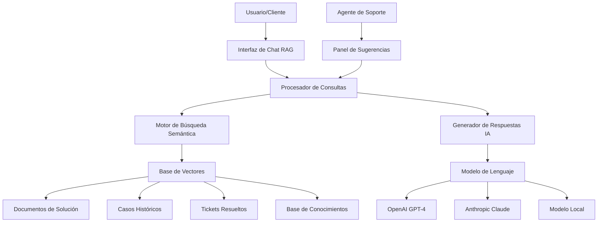

# 🤖 Sistema RAG (Retrieval-Augmented Generation) - Análisis Conceptual

## 📋 Visión General

Este documento presenta un análisis conceptual de cómo se podría implementar un Sistema RAG (Retrieval-Augmented Generation) que se integre perfectamente con el sistema de gestión de casos y helpdesk existente. **Este es un análisis teórico para evaluar las posibilidades y beneficios de tal implementación.**

## 🎯 ¿Qué es un Sistema RAG?

Un Sistema RAG combina dos componentes principales:

1. **Retrieval (Recuperación)**: Busca información relevante en una base de conocimientos
2. **Generation (Generación)**: Utiliza IA para generar respuestas basadas en la información encontrada

### Beneficios Conceptuales para el Sistema Actual

- **Respuestas Automáticas Inteligentes**: Los usuarios podrían obtener respuestas instantáneas basadas en casos previos y documentación existente
- **Reducción de Tickets Duplicados**: El sistema sugeriría soluciones existentes antes de crear nuevos tickets
- **Asistencia Contextual**: Los agentes recibirían sugerencias automáticas durante la resolución de casos
- **Aprovechamiento del Conocimiento Existente**: Todo el contenido de `solution_documents`, casos resueltos y tickets anteriores se convertirían en una base de conocimientos activa

## 🏗️ Arquitectura Conceptual

### Componentes del Sistema



### Flujo de Procesamiento Conceptual

1. **Entrada del Usuario**: Usuario hace una pregunta o describe un problema
2. **Vectorización**: El texto se convierte en representación vectorial (embedding)
3. **Búsqueda Semántica**: Se buscan documentos similares en la base vectorial
4. **Recuperación de Contexto**: Se obtienen los documentos más relevantes
5. **Generación de Respuesta**: La IA genera una respuesta usando el contexto encontrado
6. **Presentación**: Se muestra la respuesta con referencias a las fuentes

## 🗃️ Integración con el Sistema Existente

### Fuentes de Datos Actuales que se Aprovecharían

#### 1. Sistema de Documentación (`solution_documents`)

```typescript
// Tabla existente que contendría información valiosa
interface SolutionDocument {
  id: string;
  title: string;
  content: any; // Contenido rico en BlockNote
  category: string;
  tags: string[];
  is_public: boolean;
  case_id?: string; // Vinculación con casos
  // ... otros campos existentes
}
```

**Aprovechamiento RAG**: Cada documento se fragmentaría en chunks y se vectorizaría para búsqueda semántica.

#### 2. Sistema de Casos (`cases`)

```typescript
// Casos resueltos como fuente de conocimiento
interface Case {
  id: string;
  numeroCaso: string;
  descripcion: string;
  clasificacion: string; // "Resuelto", "Cerrado", etc.
  historialCaso: string;
  // ... otros campos
}
```

**Aprovechamiento RAG**: Los casos marcados como "Resueltos" se usarían como ejemplos de soluciones exitosas.

#### 3. Sistema de Tickets del Helpdesk

```typescript
// Tickets resueltos como patrones de solución
interface HelpdeskTicket {
  id: string;
  subject: string;
  description: string;
  status: "resolved" | "closed";
  resolution: string;
  category_id: string;
  // ... otros campos
}
```

**Aprovechamiento RAG**: Tickets con resoluciones exitosas proporcionarían patrones de solución rápida.

### Puntos de Integración Conceptuales

#### 1. En el Portal del Cliente

- **Chat Widget RAG**: Botón flotante que permite consultas en lenguaje natural
- **Búsqueda Inteligente**: Barra de búsqueda que entiende intención semántica
- **Sugerencias Pre-Ticket**: Antes de crear un ticket, mostrar soluciones similares

#### 2. En el Panel del Agente

- **Asistente de Resolución**: Sugerencias automáticas basadas en la descripción del problema
- **Búsqueda Contextual**: Encontrar casos similares mientras se trabaja en un ticket
- **Generación de Respuestas**: Plantillas de respuesta generadas automáticamente

#### 3. En el Sistema de Documentación

- **Auto-Categorización**: Sugerir categorías y tags basándose en el contenido
- **Contenido Relacionado**: Mostrar documentos relacionados automáticamente
- **Detección de Duplicados**: Identificar si ya existe documentación similar

## 🔧 Componentes Técnicos Conceptuales

### 1. Motor de Embeddings

```typescript
// Servicio conceptual para generar vectores
class EmbeddingService {
  // Convertiría texto a vectores numéricos
  async generateEmbedding(text: string): Promise<number[]>;

  // Procesaría documentos completos en fragmentos
  async processDocument(content: string): Promise<DocumentChunk[]>;

  // Búsqueda por similitud semántica
  async semanticSearch(query: string): Promise<SearchResult[]>;
}
```

### 2. Procesador de Consultas RAG

```typescript
// Servicio conceptual para el flujo completo RAG
class RAGProcessor {
  // Proceso completo: consulta → búsqueda → generación → respuesta
  async processQuery(
    userQuery: string,
    context?: QueryContext
  ): Promise<RAGResponse>;

  // Generación de respuestas con contexto
  async generateResponse(
    query: string,
    relevantDocs: Document[]
  ): Promise<string>;
}
```

### 3. Gestor de Contexto

```typescript
// Servicio para mantener contexto de conversaciones
class ContextManager {
  // Mantendría historial de conversación para coherencia
  async updateConversationContext(
    sessionId: string,
    newMessage: Message
  ): Promise<void>;

  // Proporcionaría contexto relevante para cada consulta
  async getRelevantContext(
    query: string,
    sessionId: string
  ): Promise<ContextData>;
}
```

## 🎨 Experiencia de Usuario Conceptual

### Escenarios de Uso

#### Escenario 1: Cliente con Problema

```
Cliente: "Mi aplicación no se conecta a la base de datos"

Sistema RAG:
1. Busca en casos similares
2. Encuentra 3 casos resueltos con problemas de conexión
3. Localiza documentación sobre configuración de BD
4. Genera respuesta: "He encontrado varios casos similares.
   Las causas más comunes son: [lista soluciones].
   También puedes consultar [documento específico]"
```

#### Escenario 2: Agente Resolviendo Ticket

```
Descripción del Ticket: "Error 500 en módulo de facturación"

Sistema RAG:
- Sidebar con sugerencias automáticas
- Casos similares resueltos previamente
- Documentación técnica relevante
- Plantillas de respuesta sugeridas
```

#### Escenario 3: Búsqueda en Knowledge Base

```
Búsqueda: "configurar SSL certificado"

Resultados RAG:
- Documentos ordenados por relevancia semántica
- Casos donde se resolvieron problemas de SSL
- Tickets relacionados con certificados
- Fragmentos específicos destacados
```

### Interfaz Conceptual

#### Chat Widget RAG

```typescript
// Componente conceptual de chat inteligente
interface RAGChatWidget {
  // Estado de conversación
  messages: ChatMessage[];
  isTyping: boolean;
  suggestions: QuickAction[];

  // Funciones principales
  sendMessage(text: string): Promise<void>;
  showSources(messageId: string): void;
  provideFeedback(helpful: boolean): void;
}
```

#### Panel de Sugerencias para Agentes

```typescript
// Panel lateral con asistencia contextual
interface AgentAssistPanel {
  // Sugerencias automáticas
  autoSuggestions: Suggestion[];
  relatedCases: Case[];
  relevantDocs: Document[];

  // Funciones de asistencia
  searchSimilar(query: string): Promise<SearchResult[]>;
  generateResponse(context: string): Promise<string>;
  markAsUseful(suggestionId: string): void;
}
```

## 📊 Base de Datos Conceptual para RAG

### Nuevas Tablas Necesarias

#### Tabla de Embeddings Vectoriales

```sql
-- Almacenaría las representaciones vectoriales
CREATE TABLE rag_embeddings (
    id UUID PRIMARY KEY,
    source_type VARCHAR(50), -- 'document', 'case', 'ticket'
    source_id UUID,          -- ID del contenido original
    content_chunk TEXT,      -- Fragmento de texto
    embedding VECTOR(1536),  -- Vector de OpenAI (1536 dimensiones)
    metadata JSONB,          -- Información adicional
    created_at TIMESTAMP,
    updated_at TIMESTAMP
);
```

#### Tabla de Conversaciones RAG

```sql
-- Historial de conversaciones con el bot
CREATE TABLE rag_conversations (
    id UUID PRIMARY KEY,
    user_id UUID,
    session_id VARCHAR(255),
    messages JSONB,          -- Array de mensajes
    context_type VARCHAR(50), -- 'general', 'ticket', 'case'
    context_id UUID,         -- ID del ticket/caso si aplica
    created_at TIMESTAMP,
    updated_at TIMESTAMP
);
```

#### Tabla de Analytics RAG

```sql
-- Métricas y analytics del sistema
CREATE TABLE rag_analytics (
    id UUID PRIMARY KEY,
    user_id UUID,
    query_text TEXT,
    results_found INTEGER,
    response_generated TEXT,
    was_helpful BOOLEAN,
    response_time_ms INTEGER,
    created_at TIMESTAMP
);
```

### Integración con Tablas Existentes

El sistema RAG se integraría sin modificar las tablas existentes:

- **`solution_documents`**: Se mantiene como está, el RAG lee de aquí
- **`cases`**: Casos resueltos se incluyen en el corpus de conocimiento
- **`helpdesk_tickets`**: Tickets cerrados aportan patrones de resolución
- **`user_profiles`**: Sistema de permisos se respeta para acceso a información

## 🔒 Consideraciones de Seguridad Conceptuales

### Control de Acceso

- **Filtrado por Permisos**: Solo se buscaría en contenido que el usuario puede ver
- **Anonimización**: Datos sensibles se filtrarían antes de procesamiento
- **Audit Trail**: Todas las consultas RAG se registrarían para auditoría

### Privacidad de Datos

- **Embeddings Locales**: Opción de usar modelos locales para datos sensibles
- **Filtrado de Contenido**: Sistema para excluir información confidencial
- **Retención de Datos**: Políticas claras sobre cuánto tiempo mantener conversaciones

## 🚀 Casos de Uso Específicos

### 1. Autoservicio del Cliente

**Problema**: Cliente tiene pregunta frecuente
**Solución RAG**:

- Chat widget responde inmediatamente
- Reduce carga de agentes
- Cliente obtiene respuesta 24/7

### 2. Asistencia al Agente

**Problema**: Agente ve ticket complejo por primera vez
**Solución RAG**:

- Sistema sugiere casos similares resueltos
- Proporciona documentación relevante
- Genera borrador de respuesta

### 3. Gestión del Conocimiento

**Problema**: Información dispersa en múltiples sistemas
**Solución RAG**:

- Búsqueda unificada en todo el conocimiento
- Encuentra conexiones entre diferentes fuentes
- Identifica gaps de documentación

### 4. Mejora Continua

**Problema**: No se aprovechan lecciones aprendidas
**Solución RAG**:

- Analiza patrones en resoluciones exitosas
- Identifica mejores prácticas automáticamente
- Sugiere actualizaciones a documentación

## 📈 Métricas de Éxito Conceptuales

### Métricas de Eficiencia

- **Reducción de Tickets**: % de consultas resueltas sin crear ticket
- **Tiempo de Resolución**: Reducción en tiempo promedio de resolución
- **Escalaciones**: Disminución en tickets escalados

### Métricas de Calidad

- **Satisfacción del Usuario**: Rating de respuestas del RAG
- **Precisión de Sugerencias**: % de sugerencias marcadas como útiles
- **Cobertura de Conocimiento**: % de consultas que encuentran respuestas relevantes

### Métricas de Adopción

- **Uso del Chat RAG**: Número de conversaciones diarias
- **Adopción por Agentes**: % de agentes usando sugerencias RAG
- **Búsquedas Semánticas**: Volumen de búsquedas vs búsquedas tradicionales

## 🎯 Beneficios Proyectados

### Para Clientes

- **Respuestas Inmediatas**: Disponibilidad 24/7 para consultas comunes
- **Autoservicio Mejorado**: Capacidad de resolver problemas sin esperar
- **Experiencia Consistente**: Respuestas basadas en mejores prácticas documentadas

### Para Agentes

- **Asistencia Inteligente**: Sugerencias contextuales durante resolución
- **Acceso Rápido al Conocimiento**: Búsqueda semántica en toda la base de datos
- **Reducción de Investigación**: Menos tiempo buscando información manualmente

### Para la Organización

- **Optimización de Recursos**: Agentes se enfocan en casos complejos
- **Conocimiento Centralizado**: Aprovechamiento máximo de información existente
- **Mejora Continua**: Identificación automática de patrones y mejoras

## 🔮 Evolución Futura Conceptual

### Fase 1: RAG Básico

- Chat simple con búsqueda en documentos
- Sugerencias básicas para agentes
- Analytics fundamentales

### Fase 2: RAG Avanzado

- Búsqueda multimodal (texto, imágenes, código)
- Generación de documentación automática
- Integración con herramientas externas

### Fase 3: RAG Inteligente

- Aprendizaje continuo de interacciones
- Personalización por usuario/contexto
- Predicción proactiva de problemas

## 💡 Consideraciones de Implementación

### Tecnologías Sugeridas

- **Vector Database**: PostgreSQL con pgvector o Pinecone
- **Embeddings**: OpenAI text-embedding-ada-002 o modelos locales
- **LLM**: GPT-4, Claude 3, o Llama 2 local
- **Framework**: LangChain o implementación custom

### Costos Estimados

- **API de IA**: $0.0001 por 1K tokens (consulta típica ~$0.01)
- **Storage Vectorial**: Mínimo para embeddings de documentos existentes
- **Infraestructura**: Incremental sobre sistema actual

### Riesgos y Mitigaciones

- **Hallucinations**: Validación estricta contra fuentes conocidas
- **Costos de API**: Límites y monitoreo de uso
- **Privacidad**: Filtrado cuidadoso de datos sensibles

## 📝 Conclusión

Un Sistema RAG integrado con el sistema actual de gestión de casos y helpdesk representaría una evolución natural que aprovecharía todo el conocimiento acumulado en la organización.

**Puntos Clave:**

- Se integraría sin modificar la arquitectura existente
- Aprovecha toda la documentación y casos históricos ya creados
- Proporciona valor inmediato tanto a clientes como a agentes
- Escalable desde implementación básica hasta sistema avanzado
- ROI medible a través de reducción de tickets y mejora en tiempos de resolución

La implementación sería gradual, comenzando con funcionalidades básicas y evolucionando hacia un sistema de asistencia inteligente completo que transformaría la experiencia de soporte tanto para usuarios finales como para el equipo de agentes.

---

_Este documento presenta un análisis conceptual de las posibilidades y beneficios de implementar un Sistema RAG en el contexto del sistema de gestión de casos existente. Todas las especificaciones técnicas y arquitecturales son propuestas teóricas para evaluación._
