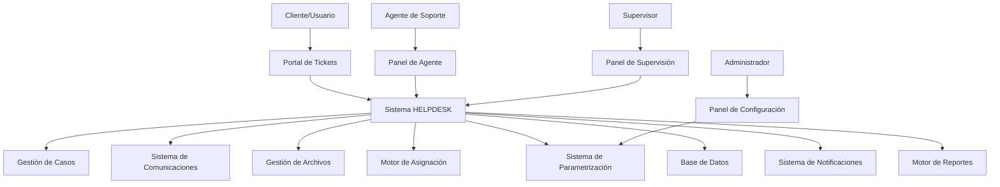
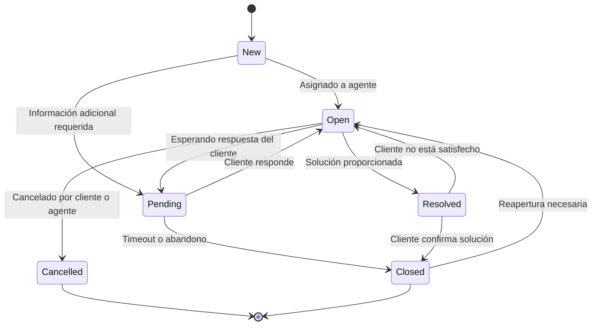

# Sistema de HELPDESK Completo - Arquitectura y Funcionalidades

## Tabla de Contenidos
1. [Visión General](#visión-general)
2. [Arquitectura del Sistema](#arquitectura-del-sistema)
3. [Base de Datos Extendida](#base-de-datos-extendida)
4. [Funcionalidades Core](#funcionalidades-core)
5. [Gestión de Tickets](#gestión-de-tickets)
6. [Sistema de Comunicaciones](#sistema-de-comunicaciones)
7. [Gestión de Archivos Adjuntos](#gestión-de-archivos-adjuntos)
8. [Asignación y Transferencia de Casos](#asignación-y-transferencia-de-casos)
9. [Sistema de Parametrización](#sistema-de-parametrización)
10. [Automatizaciones](#automatizaciones)
11. [Reportes y Analytics](#reportes-y-analytics)
12. [Sistema de Permisos y Roles](#sistema-de-permisos-y-roles)
13. [Integración con Sistema Existente](#integración-con-sistema-existente)
14. [Plan de Implementación](#plan-de-implementación)

## Visión General

El sistema de HELPDESK está diseñado para ser una solución empresarial completa que se integra perfectamente con el sistema de gestión de casos existente. Proporciona todas las funcionalidades necesarias para un soporte técnico de nivel empresarial, incluyendo gestión de tickets, comunicación directa, seguimiento de casos, asignación automática, y parametrización completa.

### Características Principales
- ✅ Creación y gestión completa de tickets
- ✅ Sistema de adjuntos avanzado con múltiples formatos
- ✅ Comunicación bidireccional en tiempo real
- ✅ Asignación automática e inteligente de casos
- ✅ Transferencia de casos entre agentes y equipos
- ✅ Sistema de escalación automática
- ✅ Parametrización completa del sistema
- ✅ SLA y métricas de rendimiento
- ✅ Integración completa con el sistema de casos existente
- ✅ Reportes y analytics avanzados

## Arquitectura del Sistema



## Base de Datos Extendida

### Tabla: helpdesk_tickets
```sql
CREATE TABLE helpdesk_tickets (
    id UUID PRIMARY KEY DEFAULT gen_random_uuid(),
    ticket_number VARCHAR(50) UNIQUE NOT NULL, -- HTK-2024-000001
    title VARCHAR(255) NOT NULL,
    description TEXT,
    
    -- Relaciones con sistema existente
    requester_id UUID REFERENCES user_profiles(id), -- Cambiado de auth.users
    assigned_to UUID REFERENCES user_profiles(id),   -- Cambiado de auth.users
    team_id UUID, -- Referencia conceptual a equipos (por implementar)
    category_id UUID REFERENCES helpdesk_categories(id),
    priority_id UUID REFERENCES helpdesk_priorities(id),
    
    -- Estados y Flujo
    status helpdesk_status_enum DEFAULT 'new',
    sub_status VARCHAR(100),
    resolution_status helpdesk_resolution_enum,
    
    -- Fechas y SLA
    created_at TIMESTAMP WITH TIME ZONE DEFAULT NOW(),
    updated_at TIMESTAMP WITH TIME ZONE DEFAULT NOW(),
    first_response_at TIMESTAMP WITH TIME ZONE,
    resolved_at TIMESTAMP WITH TIME ZONE,
    closed_at TIMESTAMP WITH TIME ZONE,
    due_date TIMESTAMP WITH TIME ZONE,
    sla_breach_at TIMESTAMP WITH TIME ZONE,
    
    -- Escalación
    escalation_level INTEGER DEFAULT 0,
    escalated_at TIMESTAMP WITH TIME ZONE,
    escalated_to UUID REFERENCES user_profiles(id), -- Cambiado de auth.users
    
    -- Integración con sistema de casos existente
    related_case_id UUID REFERENCES cases(id),
    converted_to_case BOOLEAN DEFAULT FALSE,
    
    -- Metadatos
    source helpdesk_source_enum DEFAULT 'web', -- web, email, phone, chat, api
    channel VARCHAR(50), -- específico del source
    tags TEXT[], -- array de tags, consistente con sistema existente
    custom_fields JSONB DEFAULT '{}',
    
    -- Evaluación y Feedback
    satisfaction_rating INTEGER CHECK (satisfaction_rating >= 1 AND satisfaction_rating <= 5),
    satisfaction_comment TEXT,
    
    -- Control - consistente con patrón existente
    is_deleted BOOLEAN DEFAULT FALSE,
    deleted_at TIMESTAMP WITH TIME ZONE,
    deleted_by UUID REFERENCES user_profiles(id) -- Cambiado de auth.users
);

-- Enums
CREATE TYPE helpdesk_status_enum AS ENUM (
    'new', 'open', 'pending', 'resolved', 'closed', 'cancelled'
);

CREATE TYPE helpdesk_resolution_enum AS ENUM (
    'solved', 'workaround', 'duplicate', 'not_reproducible', 'won_t_fix'
);

CREATE TYPE helpdesk_source_enum AS ENUM (
    'web', 'email', 'phone', 'chat', 'api', 'mobile'
);
```

### Tabla: helpdesk_categories
```sql
CREATE TABLE helpdesk_categories (
    id UUID PRIMARY KEY DEFAULT gen_random_uuid(),
    name VARCHAR(100) NOT NULL,
    description TEXT,
    parent_id UUID REFERENCES helpdesk_categories(id),
    color VARCHAR(7), -- Color hex, consistente con solution_categories
    icon VARCHAR(50), -- Nombre del icono
    
    -- Configuración
    auto_assign_to UUID REFERENCES user_profiles(id), -- Cambiado de auth.users
    auto_assign_team UUID, -- Referencia conceptual a equipos
    default_priority_id UUID REFERENCES helpdesk_priorities(id),
    sla_hours INTEGER DEFAULT 24,
    
    -- Flujo personalizado
    custom_workflow JSONB DEFAULT '{}',
    required_fields TEXT[],
    optional_fields TEXT[],
    
    -- Control - consistente con patrón existente
    is_active BOOLEAN DEFAULT TRUE,
    sort_order INTEGER DEFAULT 0, -- Consistente con display_order en otros sistemas
    created_at TIMESTAMP WITH TIME ZONE DEFAULT NOW(),
    updated_at TIMESTAMP WITH TIME ZONE DEFAULT NOW()
);
```

### Tabla: helpdesk_priorities
```sql
CREATE TABLE helpdesk_priorities (
    id UUID PRIMARY KEY DEFAULT gen_random_uuid(),
    name VARCHAR(50) NOT NULL, -- Crítica, Alta, Media, Baja
    description TEXT,
    color VARCHAR(7), -- Color hex, consistente con todo_priorities
    level INTEGER UNIQUE NOT NULL, -- 1=Crítica, 2=Alta, 3=Media, 4=Baja
    
    -- SLA por prioridad
    first_response_hours INTEGER DEFAULT 4,
    resolution_hours INTEGER DEFAULT 24,
    
    -- Escalación automática
    auto_escalate BOOLEAN DEFAULT FALSE,
    escalate_after_hours INTEGER,
    escalate_to_priority_id UUID REFERENCES helpdesk_priorities(id),
    
    -- Control - consistente con patrón existente
    is_active BOOLEAN DEFAULT TRUE,
    is_default BOOLEAN DEFAULT FALSE,
    display_order INTEGER DEFAULT 0, -- Consistente con todo_priorities
    created_at TIMESTAMP WITH TIME ZONE DEFAULT NOW()
);
```

### Tabla: helpdesk_communications
```sql
CREATE TABLE helpdesk_communications (
    id UUID PRIMARY KEY DEFAULT gen_random_uuid(),
    ticket_id UUID REFERENCES helpdesk_tickets(id) ON DELETE CASCADE,
    
    -- Comunicación
    type helpdesk_comm_type_enum DEFAULT 'comment',
    content TEXT NOT NULL,
    content_type VARCHAR(20) DEFAULT 'text', -- text, html, markdown
    
    -- Autor - usando sistema de user_profiles existente
    author_id UUID REFERENCES user_profiles(id),
    author_type helpdesk_author_type_enum DEFAULT 'agent',
    
    -- Visibilidad
    is_public BOOLEAN DEFAULT TRUE, -- Visible para el cliente
    is_internal BOOLEAN DEFAULT FALSE, -- Solo visible para agentes
    
    -- Adjuntos
    has_attachments BOOLEAN DEFAULT FALSE,
    
    -- Metadatos
    source VARCHAR(50) DEFAULT 'web', -- web, email, phone, chat
    channel_data JSONB DEFAULT '{}', -- datos específicos del canal
    
    -- Fechas - consistente con patrón existente
    created_at TIMESTAMP WITH TIME ZONE DEFAULT NOW(),
    updated_at TIMESTAMP WITH TIME ZONE DEFAULT NOW(),
    
    -- Control - consistente con patrón existente
    is_deleted BOOLEAN DEFAULT FALSE,
    deleted_at TIMESTAMP WITH TIME ZONE,
    deleted_by UUID REFERENCES user_profiles(id) -- Cambiado de auth.users
);

CREATE TYPE helpdesk_comm_type_enum AS ENUM (
    'comment', 'note', 'solution', 'escalation', 'assignment', 'status_change'
);

CREATE TYPE helpdesk_author_type_enum AS ENUM (
    'customer', 'agent', 'system', 'supervisor', 'admin'
);
```

### Tabla: helpdesk_attachments
```sql
CREATE TABLE helpdesk_attachments (
    id UUID PRIMARY KEY DEFAULT gen_random_uuid(),
    ticket_id UUID REFERENCES helpdesk_tickets(id) ON DELETE CASCADE,
    communication_id UUID REFERENCES helpdesk_communications(id) ON DELETE CASCADE,
    
    -- Archivo - consistente con document_attachments existente
    filename VARCHAR(255) NOT NULL, -- file_name en el sistema existente
    original_filename VARCHAR(255) NOT NULL,
    file_path VARCHAR(500) NOT NULL, -- TEXT en document_attachments, pero VARCHAR es suficiente
    file_size BIGINT NOT NULL, -- Consistente con document_attachments
    mime_type VARCHAR(100) NOT NULL, -- TEXT en document_attachments
    file_hash VARCHAR(64), -- SHA-256 para deduplicación
    
    -- Metadatos - usando user_profiles como en el sistema existente
    uploaded_by UUID REFERENCES user_profiles(id), -- Cambiado de auth.users
    upload_source VARCHAR(50) DEFAULT 'web',
    
    -- Procesamiento
    is_processed BOOLEAN DEFAULT FALSE,
    thumbnail_path VARCHAR(500),
    preview_available BOOLEAN DEFAULT FALSE,
    
    -- Seguridad
    is_safe BOOLEAN DEFAULT TRUE,
    virus_scan_result VARCHAR(50),
    scan_date TIMESTAMP WITH TIME ZONE,
    
    -- Fechas - consistente con patrón existente
    created_at TIMESTAMP WITH TIME ZONE DEFAULT NOW(),
    
    -- Control - consistente con patrón existente
    is_deleted BOOLEAN DEFAULT FALSE,
    deleted_at TIMESTAMP WITH TIME ZONE,
    deleted_by UUID REFERENCES user_profiles(id) -- Cambiado de auth.users
);
```

### Tabla: helpdesk_assignments
```sql
CREATE TABLE helpdesk_assignments (
    id UUID PRIMARY KEY DEFAULT gen_random_uuid(),
    ticket_id UUID REFERENCES helpdesk_tickets(id) ON DELETE CASCADE,
    
    -- Asignación - usando user_profiles como en el sistema existente
    assigned_from UUID REFERENCES user_profiles(id),
    assigned_to UUID REFERENCES user_profiles(id),
    team_id UUID, -- Referencia conceptual a equipos
    
    -- Tipo de asignación
    assignment_type helpdesk_assignment_type_enum DEFAULT 'manual',
    assignment_reason TEXT,
    
    -- Fechas - consistente con patrón existente
    assigned_at TIMESTAMP WITH TIME ZONE DEFAULT NOW(),
    accepted_at TIMESTAMP WITH TIME ZONE,
    completed_at TIMESTAMP WITH TIME ZONE,
    
    -- Estado
    status helpdesk_assignment_status_enum DEFAULT 'pending',
    
    -- Metadatos
    auto_assignment_rule_id UUID REFERENCES helpdesk_assignment_rules(id),
    assignment_score INTEGER, -- para algoritmos de balanceeo
    
    -- Control - consistente con patrón existente
    is_active BOOLEAN DEFAULT TRUE
);

CREATE TYPE helpdesk_assignment_type_enum AS ENUM (
    'manual', 'auto', 'escalation', 'transfer', 'reassignment'
);

CREATE TYPE helpdesk_assignment_status_enum AS ENUM (
    'pending', 'accepted', 'rejected', 'completed', 'cancelled'
);
```

### Tabla: helpdesk_assignment_rules
```sql
CREATE TABLE helpdesk_assignment_rules (
    id UUID PRIMARY KEY DEFAULT gen_random_uuid(),
    name VARCHAR(100) NOT NULL,
    description TEXT,
    
    -- Condiciones (JSON con lógica flexible)
    conditions JSONB NOT NULL DEFAULT '{}',
    
    -- Acciones
    action_type helpdesk_rule_action_enum NOT NULL,
    action_config JSONB NOT NULL DEFAULT '{}',
    
    -- Configuración - consistente con patrón existente
    priority INTEGER DEFAULT 0, -- Orden de evaluación
    is_active BOOLEAN DEFAULT TRUE,
    
    -- Programación
    schedule_config JSONB DEFAULT '{}', -- horarios, días, etc.
    
    -- Metadatos - usando user_profiles como en el sistema existente
    created_by UUID REFERENCES user_profiles(id),
    created_at TIMESTAMP WITH TIME ZONE DEFAULT NOW(),
    updated_at TIMESTAMP WITH TIME ZONE DEFAULT NOW()
);

CREATE TYPE helpdesk_rule_action_enum AS ENUM (
    'assign_to_user', 'assign_to_team', 'set_priority', 'set_category', 
    'escalate', 'auto_close', 'send_notification', 'create_case'
);
```

### Tabla: helpdesk_sla_policies
```sql
CREATE TABLE helpdesk_sla_policies (
    id UUID PRIMARY KEY DEFAULT uuid_generate_v4(),
    name VARCHAR(100) NOT NULL,
    description TEXT,
    
    -- Condiciones para aplicar esta política
    conditions JSONB NOT NULL DEFAULT '{}',
    
    -- Métricas SLA
    first_response_hours INTEGER NOT NULL DEFAULT 4,
    resolution_hours INTEGER NOT NULL DEFAULT 24,
    
    -- Horario de trabajo
    business_hours_only BOOLEAN DEFAULT TRUE,
    timezone VARCHAR(50) DEFAULT 'UTC',
    
    -- Escalación
    escalation_enabled BOOLEAN DEFAULT TRUE,
    escalation_rules JSONB DEFAULT '{}',
    
    -- Control
    is_active BOOLEAN DEFAULT TRUE,
    priority INTEGER DEFAULT 0,
    
    created_at TIMESTAMP WITH TIME ZONE DEFAULT NOW(),
    updated_at TIMESTAMP WITH TIME ZONE DEFAULT NOW()
);
```

### Tabla: helpdesk_knowledge_base
```sql
CREATE TABLE helpdesk_knowledge_base (
    id UUID PRIMARY KEY DEFAULT gen_random_uuid(),
    title VARCHAR(255) NOT NULL,
    content TEXT NOT NULL, -- Podría ser JSONB como solution_documents para consistencia
    
    -- Categorización - similar a solution_documents existente
    category_id UUID REFERENCES helpdesk_categories(id),
    tags TEXT[], -- Consistente con tags en solution_documents
    
    -- Visibilidad
    is_public BOOLEAN DEFAULT FALSE, -- Visible para clientes
    is_internal BOOLEAN DEFAULT TRUE, -- Visible para agentes
    
    -- Metadatos - usando user_profiles como en solution_documents
    author_id UUID REFERENCES user_profiles(id), -- Cambiado de auth.users
    views_count INTEGER DEFAULT 0, -- Consistente con solution_documents.view_count
    helpful_votes INTEGER DEFAULT 0, -- Consistente con solution_documents.helpful_count
    unhelpful_votes INTEGER DEFAULT 0,
    
    -- Fechas - consistente con patrón existente
    created_at TIMESTAMP WITH TIME ZONE DEFAULT NOW(),
    updated_at TIMESTAMP WITH TIME ZONE DEFAULT NOW(),
    published_at TIMESTAMP WITH TIME ZONE,
    
    -- Control - consistente con patrón existente
    is_active BOOLEAN DEFAULT TRUE,
    is_featured BOOLEAN DEFAULT FALSE
);
```

### Tabla: helpdesk_configurations
```sql
CREATE TABLE helpdesk_configurations (
    id UUID PRIMARY KEY DEFAULT gen_random_uuid(),
    category VARCHAR(100) NOT NULL, -- general, notifications, sla, etc.
    key VARCHAR(100) NOT NULL,
    value JSONB NOT NULL,
    data_type VARCHAR(50) NOT NULL, -- string, number, boolean, object, array
    
    -- Metadatos
    description TEXT,
    is_system BOOLEAN DEFAULT FALSE, -- No editable por usuarios
    is_sensitive BOOLEAN DEFAULT FALSE, -- Datos sensibles (passwords, etc.)
    
    -- Control - usando user_profiles como en el sistema existente
    updated_by UUID REFERENCES user_profiles(id), -- Cambiado de auth.users
    updated_at TIMESTAMP WITH TIME ZONE DEFAULT NOW(),
    
    UNIQUE(category, key)
);
```

### Tabla: helpdesk_automation_workflows
```sql
CREATE TABLE helpdesk_automation_workflows (
    id UUID PRIMARY KEY DEFAULT gen_random_uuid(),
    name VARCHAR(100) NOT NULL,
    description TEXT,
    
    -- Trigger
    trigger_type helpdesk_trigger_enum NOT NULL,
    trigger_conditions JSONB NOT NULL DEFAULT '{}',
    
    -- Acciones
    actions JSONB NOT NULL DEFAULT '[]',
    
    -- Configuración - consistente con patrón existente
    is_active BOOLEAN DEFAULT TRUE,
    priority INTEGER DEFAULT 0,
    
    -- Limitaciones
    max_executions_per_day INTEGER,
    executions_today INTEGER DEFAULT 0,
    last_execution_date DATE,
    
    -- Métricas
    total_executions INTEGER DEFAULT 0,
    success_rate DECIMAL(5,2) DEFAULT 0.00,
    
    -- Control - usando user_profiles como en el sistema existente
    created_by UUID REFERENCES user_profiles(id), -- Cambiado de auth.users
    created_at TIMESTAMP WITH TIME ZONE DEFAULT NOW(),
    updated_at TIMESTAMP WITH TIME ZONE DEFAULT NOW()
);

CREATE TYPE helpdesk_trigger_enum AS ENUM (
    'ticket_created', 'ticket_updated', 'status_changed', 'assigned', 
    'escalated', 'comment_added', 'sla_breach', 'scheduled'
);
```

## Funcionalidades Core

### 1. Portal del Cliente
- **Creación de Tickets**: Formulario inteligente con categorización automática
- **Seguimiento en Tiempo Real**: Portal donde el cliente puede ver el estado de sus tickets
- **Comunicación Directa**: Chat integrado y comentarios en el ticket
- **Base de Conocimientos**: Búsqueda de soluciones antes de crear ticket
- **Historial Completo**: Todos los tickets previos del cliente
- **Evaluación de Servicio**: Rating y feedback al cerrar el ticket

### 2. Panel del Agente
- **Dashboard Personalizado**: Vista de tickets asignados, métricas personales
- **Cola de Trabajo**: Tickets organizados por prioridad y SLA
- **Editor Rico**: Respuestas con formato, plantillas predefinidas
- **Vista Unificada**: Toda la información del cliente en una sola pantalla
- **Herramientas de Colaboración**: Consultas internas, transferencias
- **Macros y Automatizaciones**: Respuestas rápidas para casos comunes

### 3. Panel del Supervisor
- **Monitoreo en Tiempo Real**: Estado de todos los tickets del equipo
- **Gestión de Carga**: Balanceo automático de tickets entre agentes
- **Métricas y KPIs**: SLA, tiempo de respuesta, satisfacción del cliente
- **Escalaciones**: Gestión de casos complejos
- **Reportes Avanzados**: Analytics de rendimiento del equipo

## Gestión de Tickets

### Ciclo de Vida del Ticket


### Estados Avanzados
- **New**: Ticket recién creado, pendiente de asignación
- **Open**: Asignado y en trabajo activo
- **Pending**: Esperando información del cliente o terceros
- **Resolved**: Solución proporcionada, esperando confirmación
- **Closed**: Caso cerrado exitosamente
- **Cancelled**: Cancelado por duplicado o invalido

### Sub-estados Personalizables
- Waiting for Customer
- Waiting for Vendor
- Under Investigation
- Testing Solution
- Scheduled for Deployment

## Sistema de Comunicaciones

### Canales de Comunicación
1. **Web Portal**: Interfaz principal para clientes y agentes
2. **Email Integration**: Tickets creados y actualizados vía email
3. **Chat en Vivo**: Comunicación instantánea
4. **API REST**: Integración con sistemas externos
5. **Mobile App**: Aplicación móvil para clientes y agentes
6. **Webhooks**: Notificaciones en tiempo real

### Funcionalidades de Comunicación
- **Conversaciones Threaded**: Hilos de conversación organizados
- **Menciones**: @usuario para notificaciones directas
- **Mensaje Privados**: Comunicación interna entre agentes
- **Plantillas**: Respuestas predefinidas personalizables
- **Firmas Automáticas**: Firmas personalizadas por agente
- **Traducciones**: Soporte multiidioma automático

### Sistema de Notificaciones
```typescript
interface NotificationConfig {
  ticket_created: {
    customer: boolean;
    assigned_agent: boolean;
    supervisor: boolean;
    team: boolean;
  };
  status_changed: {
    customer: boolean;
    assigned_agent: boolean;
    previous_agent?: boolean;
  };
  sla_warning: {
    assigned_agent: boolean;
    supervisor: boolean;
    escalation_targets: boolean;
  };
  new_comment: {
    customer: boolean;
    assigned_agent: boolean;
    mentioned_users: boolean;
  };
}
```

## Gestión de Archivos Adjuntos

### Tipos de Archivos Soportados
- **Documentos**: PDF, DOC, DOCX, TXT, RTF
- **Imágenes**: JPG, PNG, GIF, BMP, SVG, WEBP
- **Videos**: MP4, AVI, MOV, WMV (con límites de tamaño)
- **Audio**: MP3, WAV, OGG
- **Archivos**: ZIP, RAR, 7Z
- **Logs**: LOG, TXT con syntax highlighting
- **Código**: JS, TS, HTML, CSS, SQL con syntax highlighting

### Funcionalidades Avanzadas
- **Vista Previa**: Visualización de archivos sin descargar
- **Miniaturas**: Thumbnails para imágenes y videos
- **Compresión Automática**: Optimización de archivos grandes
- **Scan de Virus**: Análisis automático de seguridad
- **Versionado**: Control de versiones de archivos
- **Deduplicación**: Evitar archivos duplicados
- **Búsqueda en Contenido**: OCR para imágenes y PDFs

### Configuración de Seguridad
```typescript
interface AttachmentSecurity {
  maxFileSize: number; // MB
  allowedMimeTypes: string[];
  virusScanEnabled: boolean;
  quarantineEnabled: boolean;
  encryptionEnabled: boolean;
  retentionDays: number;
  accessControl: {
    customerCanDownload: boolean;
    agentCanDownload: boolean;
    externalShareEnabled: boolean;
  };
}
```

## Asignación y Transferencia de Casos

### Sistema de Asignación Inteligente
1. **Round Robin**: Distribución equitativa entre agentes
2. **Load Balancing**: Considerando carga actual de trabajo
3. **Skill-based**: Basado en experticia y categoría
4. **Priority-based**: Agentes premium para casos críticos
5. **Geographic**: Asignación por zona horaria o ubicación
6. **Previous History**: Asignar al agente que ya conoce al cliente

### Algoritmo de Asignación
```typescript
interface AssignmentCriteria {
  agent_availability: boolean;
  current_workload: number;
  skills_match: number; // 0-100
  language_match: boolean;
  timezone_compatibility: boolean;
  customer_preference?: string;
  category_expertise: number; // 0-100
  priority_clearance: boolean;
}

interface AssignmentScore {
  agent_id: string;
  score: number;
  factors: AssignmentCriteria;
  reasoning: string;
}
```

### Transferencia de Casos
- **Transferencia Simple**: Entre agentes del mismo nivel
- **Escalación**: A supervisor o especialista
- **Transfer con Contexto**: Toda la historia se mantiene
- **Transferencia Temporal**: Para ausencias o vacaciones
- **Handoff Notes**: Notas específicas para el nuevo agente

### Reglas de Escalación
```typescript
interface EscalationRule {
  trigger: {
    time_in_status: number; // hours
    priority_level: number;
    category: string;
    customer_tier?: string;
  };
  action: {
    escalate_to: 'supervisor' | 'specialist' | 'manager';
    notify_list: string[];
    priority_increase: boolean;
    sla_adjustment: number; // hours
  };
}
```

## Sistema de Parametrización

### Configuraciones Generales
```typescript
interface HelpdeskConfig {
  general: {
    company_name: string;
    support_email: string;
    business_hours: BusinessHours;
    timezone: string;
    auto_close_days: number;
    ticket_numbering_format: string; // HTK-{YYYY}-{######}
  };
  
  ticket_settings: {
    allow_customer_priority_change: boolean;
    require_category_selection: boolean;
    allow_anonymous_tickets: boolean;
    max_attachments_per_ticket: number;
    auto_assign_enabled: boolean;
    satisfaction_survey_enabled: boolean;
  };
  
  sla_settings: {
    business_hours_only: boolean;
    weekend_support: boolean;
    holiday_schedule: Holiday[];
    grace_period_minutes: number;
  };
  
  notification_settings: {
    email_notifications: boolean;
    sms_notifications: boolean;
    push_notifications: boolean;
    notification_frequency: 'immediate' | 'hourly' | 'daily';
  };
}
```

### Campos Personalizados
```typescript
interface CustomField {
  id: string;
  name: string;
  type: 'text' | 'textarea' | 'select' | 'multiselect' | 'date' | 'number' | 'boolean';
  required: boolean;
  visible_to_customer: boolean;
  editable_by_customer: boolean;
  options?: string[]; // para select/multiselect
  validation_rules?: ValidationRule[];
  help_text?: string;
  category_specific?: string[]; // categorías donde aparece
}
```

### Plantillas Personalizables
- **Email Templates**: Para cada tipo de notificación
- **Response Templates**: Respuestas comunes por categoría
- **Auto-responses**: Respuestas automáticas por estado
- **Signature Templates**: Firmas personalizadas por agente/equipo

## Automatizaciones

### Workflow Engine
```typescript
interface WorkflowRule {
  id: string;
  name: string;
  trigger: {
    event: WorkflowTrigger;
    conditions: Condition[];
  };
  actions: Action[];
  schedule?: Schedule;
  enabled: boolean;
}

type WorkflowTrigger = 
  | 'ticket_created'
  | 'ticket_updated' 
  | 'status_changed'
  | 'priority_changed'
  | 'assigned'
  | 'comment_added'
  | 'attachment_added'
  | 'sla_breach'
  | 'customer_replied'
  | 'agent_replied'
  | 'scheduled';

interface Action {
  type: 'assign' | 'notify' | 'update_field' | 'add_comment' | 'escalate' | 'close' | 'create_case';
  config: any;
  delay_minutes?: number;
}
```

### Automatizaciones Predefinidas
1. **Auto-assignment**: Asignación automática basada en reglas
2. **SLA Monitoring**: Monitoreo y alertas de SLA
3. **Auto-escalation**: Escalación automática por tiempo
4. **Auto-close**: Cierre automático de tickets resueltos
5. **Satisfaction Survey**: Envío automático de encuestas
6. **Knowledge Base Suggestions**: Sugerencias automáticas de KB
7. **Duplicate Detection**: Detección automática de duplicados
8. **VIP Customer Handling**: Manejo especial para clientes VIP

### Macros para Agentes
```typescript
interface Macro {
  id: string;
  name: string;
  description: string;
  actions: MacroAction[];
  category: string;
  shortcut_key?: string;
  visible_to_all: boolean;
  created_by: string;
}

interface MacroAction {
  type: 'set_status' | 'set_priority' | 'add_comment' | 'assign' | 'add_tags';
  value: any;
  prompt_for_input?: boolean;
}
```

## Reportes y Analytics

### Métricas de Rendimiento
1. **SLA Compliance**: Porcentaje de cumplimiento de SLA
2. **First Response Time**: Tiempo promedio de primera respuesta
3. **Resolution Time**: Tiempo promedio de resolución
4. **Customer Satisfaction**: Rating promedio y distribución
5. **Agent Performance**: Métricas individuales por agente
6. **Volume Trends**: Tendencias de volumen de tickets
7. **Category Analysis**: Análisis por categorías
8. **Escalation Rate**: Porcentaje de tickets escalados

### Dashboards Ejecutivos
```typescript
interface ExecutiveDashboard {
  overview: {
    total_tickets_today: number;
    total_tickets_month: number;
    average_satisfaction: number;
    sla_compliance_rate: number;
  };
  
  trends: {
    volume_trend: ChartData;
    satisfaction_trend: ChartData;
    resolution_time_trend: ChartData;
  };
  
  team_performance: {
    top_performers: Agent[];
    team_metrics: TeamMetrics;
    workload_distribution: WorkloadData;
  };
  
  business_insights: {
    top_issues: IssueData[];
    customer_feedback: FeedbackSummary;
    improvement_opportunities: Recommendation[];
  };
}
```

### Reportes Personalizables
- **Report Builder**: Constructor visual de reportes
- **Scheduled Reports**: Reportes automáticos por email
- **Export Options**: PDF, Excel, CSV
- **Drill-down Capability**: Capacidad de profundizar en los datos
- **Comparative Analysis**: Comparación entre períodos
- **Forecasting**: Predicciones basadas en tendencias

## Sistema de Permisos y Roles

### Roles del Sistema HELPDESK

#### 1. Roles de Cliente
```typescript
interface CustomerPermissions {
  tickets: {
    create: boolean; // Crear nuevos tickets
    read_own: boolean; // Ver sus propios tickets
    update_own: boolean; // Actualizar sus tickets (agregar comentarios)
    attach_files: boolean; // Adjuntar archivos
    rate_service: boolean; // Calificar el servicio
    reopen_ticket: boolean; // Reabrir tickets cerrados
    escalate: boolean; // Solicitar escalación
  };
  
  knowledge_base: {
    search: boolean; // Buscar en base de conocimientos
    view_public: boolean; // Ver artículos públicos
    rate_articles: boolean; // Calificar utilidad de artículos
  };
  
  communication: {
    add_public_comments: boolean; // Agregar comentarios públicos
    view_public_history: boolean; // Ver historial de comunicaciones públicas
    receive_notifications: boolean; // Recibir notificaciones
  };
}
```

#### 2. Roles de Agente de Soporte
```typescript
interface AgentPermissions {
  tickets: {
    read_assigned: boolean; // Ver tickets asignados
    read_team: boolean; // Ver tickets del equipo
    read_all: boolean; // Ver todos los tickets (según nivel)
    update_assigned: boolean; // Actualizar tickets asignados
    update_status: boolean; // Cambiar estado de tickets
    assign_self: boolean; // Auto-asignarse tickets
    close_tickets: boolean; // Cerrar tickets
    reopen_tickets: boolean; // Reabrir tickets
    merge_tickets: boolean; // Fusionar tickets duplicados
    convert_to_case: boolean; // Convertir ticket a caso
  };
  
  communication: {
    add_public_comments: boolean; // Comentarios visibles al cliente
    add_internal_notes: boolean; // Notas internas
    view_all_communications: boolean; // Ver todo el historial
    edit_own_comments: boolean; // Editar sus propios comentarios
    delete_own_comments: boolean; // Eliminar sus comentarios
  };
  
  knowledge_base: {
    search: boolean; // Buscar artículos
    view_internal: boolean; // Ver artículos internos
    create_articles: boolean; // Crear artículos
    suggest_articles: boolean; // Sugerir artículos a clientes
  };
  
  customers: {
    view_customer_info: boolean; // Ver información del cliente
    view_customer_history: boolean; // Ver historial de tickets del cliente
    impersonate_customer: boolean; // Actuar en nombre del cliente (solo supervisores)
  };
  
  attachments: {
    upload: boolean; // Subir archivos
    download: boolean; // Descargar archivos
    delete_own: boolean; // Eliminar sus archivos
    view_all: boolean; // Ver todos los archivos del ticket
  };
  
  reports: {
    view_personal_metrics: boolean; // Ver sus propias métricas
    view_team_summary: boolean; // Ver resumen del equipo
  };
}
```

#### 3. Roles de Supervisor/Team Lead
```typescript
interface SupervisorPermissions extends AgentPermissions {
  tickets: {
    read_all_team: boolean; // Ver todos los tickets del equipo
    assign_to_agents: boolean; // Asignar tickets a agentes
    reassign_tickets: boolean; // Reasignar tickets
    escalate_tickets: boolean; // Escalar tickets
    force_close: boolean; // Forzar cierre de tickets
    override_sla: boolean; // Modificar SLA de tickets específicos
    bulk_operations: boolean; // Operaciones masivas
  };
  
  team_management: {
    view_agent_performance: boolean; // Ver rendimiento de agentes
    manage_agent_workload: boolean; // Gestionar carga de trabajo
    view_team_metrics: boolean; // Métricas del equipo
    assign_agent_schedules: boolean; // Asignar horarios
  };
  
  escalations: {
    receive_escalations: boolean; // Recibir tickets escalados
    escalate_to_management: boolean; // Escalar a gerencia
    resolve_conflicts: boolean; // Resolver conflictos entre agentes
  };
  
  configuration: {
    manage_categories: boolean; // Gestionar categorías del equipo
    manage_templates: boolean; // Gestionar plantillas
    configure_auto_assignment: boolean; // Configurar asignación automática
  };
  
  reports: {
    view_team_analytics: boolean; // Analytics del equipo
    export_team_reports: boolean; // Exportar reportes
    schedule_reports: boolean; // Programar reportes automáticos
  };
}
```

#### 4. Roles de Administrador del Sistema
```typescript
interface AdminPermissions {
  system_configuration: {
    manage_global_settings: boolean; // Configuraciones globales
    manage_sla_policies: boolean; // Políticas de SLA
    manage_business_hours: boolean; // Horarios de trabajo
    manage_notification_settings: boolean; // Configuración de notificaciones
    manage_security_settings: boolean; // Configuraciones de seguridad
  };
  
  user_management: {
    create_users: boolean; // Crear usuarios
    modify_users: boolean; // Modificar usuarios
    assign_roles: boolean; // Asignar roles
    deactivate_users: boolean; // Desactivar usuarios
    reset_passwords: boolean; // Resetear contraseñas
  };
  
  helpdesk_configuration: {
    manage_categories: boolean; // Gestionar todas las categorías
    manage_priorities: boolean; // Gestionar prioridades
    manage_statuses: boolean; // Gestionar estados personalizados
    manage_custom_fields: boolean; // Campos personalizados
    manage_workflows: boolean; // Configurar workflows
    manage_automation_rules: boolean; // Reglas de automatización
  };
  
  integration_management: {
    configure_email_integration: boolean; // Integración de email
    manage_api_keys: boolean; // Gestionar claves API
    configure_webhooks: boolean; // Configurar webhooks
    manage_external_integrations: boolean; // Integraciones externas
  };
  
  system_monitoring: {
    view_system_logs: boolean; // Ver logs del sistema
    view_audit_trail: boolean; // Ver auditoría completa
    monitor_performance: boolean; // Monitorear rendimiento
    manage_backups: boolean; // Gestionar respaldos
  };
  
  knowledge_base: {
    manage_all_articles: boolean; // Gestionar todos los artículos
    configure_kb_settings: boolean; // Configurar base de conocimientos
    moderate_content: boolean; // Moderar contenido
  };
  
  reports_analytics: {
    view_all_reports: boolean; // Ver todos los reportes
    create_custom_reports: boolean; // Crear reportes personalizados
    export_all_data: boolean; // Exportar todos los datos
    configure_dashboards: boolean; // Configurar dashboards
  };
}
```

### Matriz de Permisos por Funcionalidad

| Funcionalidad | Cliente | Agente | Supervisor | Admin |
|---------------|---------|---------|------------|-------|
| **Tickets** |
| Crear ticket | ✅ | ✅ | ✅ | ✅ |
| Ver tickets propios | ✅ | ✅ | ✅ | ✅ |
| Ver tickets del equipo | ❌ | ✅ | ✅ | ✅ |
| Ver todos los tickets | ❌ | ❌ | Limitado | ✅ |
| Asignar tickets | ❌ | Limitado | ✅ | ✅ |
| Cambiar prioridad | ❌ | ✅ | ✅ | ✅ |
| Cerrar tickets | ❌ | ✅ | ✅ | ✅ |
| Reabrir tickets | ✅ | ✅ | ✅ | ✅ |
| Escalar tickets | ✅ | ✅ | ✅ | ✅ |
| **Comunicación** |
| Comentarios públicos | ✅ | ✅ | ✅ | ✅ |
| Notas internas | ❌ | ✅ | ✅ | ✅ |
| Ver historial completo | Limitado | ✅ | ✅ | ✅ |
| **Archivos** |
| Subir archivos | ✅ | ✅ | ✅ | ✅ |
| Descargar archivos | ✅ | ✅ | ✅ | ✅ |
| Eliminar archivos | Propios | Propios | ✅ | ✅ |
| **Configuración** |
| Configurar categorías | ❌ | ❌ | Limitado | ✅ |
| Configurar SLA | ❌ | ❌ | ❌ | ✅ |
| Configurar workflows | ❌ | ❌ | ❌ | ✅ |
| **Reportes** |
| Ver métricas propias | ❌ | ✅ | ✅ | ✅ |
| Ver métricas del equipo | ❌ | ❌ | ✅ | ✅ |
| Ver métricas globales | ❌ | ❌ | ❌ | ✅ |

### Permisos Especiales y Contextuales

#### Permisos Basados en Contexto
```typescript
interface ContextualPermissions {
  ticket_ownership: {
    // El agente asignado tiene permisos adicionales
    assigned_agent_can: [
      'update_ticket',
      'change_status',
      'add_time_tracking',
      'request_escalation'
    ];
    
    // El cliente que creó el ticket puede
    ticket_creator_can: [
      'view_ticket',
      'add_comments',
      'upload_attachments',
      'close_ticket',
      'reopen_ticket'
    ];
  };
  
  time_based_permissions: {
    // Permisos que cambian según el tiempo
    business_hours_only: [
      'auto_assign_tickets',
      'send_escalation_alerts',
      'trigger_sla_warnings'
    ];
    
    // Permisos de emergencia fuera de horario
    after_hours_emergency: [
      'escalate_to_on_call',
      'bypass_normal_assignment',
      'send_emergency_notifications'
    ];
  };
  
  priority_based_permissions: {
    // Permisos especiales para tickets críticos
    critical_priority: {
      requires_supervisor_approval: ['close_ticket'];
      auto_notify: ['supervisor', 'management'];
      bypass_sla: false;
    };
    
    // Permisos para tickets de baja prioridad
    low_priority: {
      auto_close_after_days: 30;
      allow_bulk_operations: true;
      require_minimal_documentation: true;
    };
  };
}
```

### Integración con Sistema de Permisos Existente

El sistema de HELPDESK se integrará con las tablas de permisos existentes:
- `permissions` - Para definir permisos específicos del HELPDESK
- `roles` - Para roles específicos del HELPDESK que se integran con los roles existentes
- `role_permissions` - Para asignar permisos del HELPDESK a roles
- `user_profiles` - Ya tiene `role_id` que referencia la tabla `roles`

### Extensión de la Tabla de Permisos Existente

Los permisos del HELPDESK se agregarán a la tabla `permissions` existente, utilizando el campo `scope` ya disponible:

```sql
-- La tabla permissions ya existe con la estructura:
-- permissions (id, name, description, resource, action, is_active, scope, created_at, updated_at)
-- 
-- Solo necesitamos agregar permisos específicos del HELPDESK
```

### Roles Específicos del HELPDESK

```sql
-- Tabla para extender funcionalidades específicas del HELPDESK en roles
CREATE TABLE helpdesk_role_extensions (
    id UUID PRIMARY KEY DEFAULT gen_random_uuid(),
    role_id UUID REFERENCES roles(id) ON DELETE CASCADE,
    hierarchy_level INTEGER DEFAULT 0, -- 0=cliente, 1=agente, 2=supervisor, 3=admin
    team_id UUID, -- Referencia conceptual a equipos
    granted_by UUID REFERENCES user_profiles(id),
    granted_at TIMESTAMP WITH TIME ZONE DEFAULT NOW(),
    expires_at TIMESTAMP WITH TIME ZONE, -- roles temporales
    is_active BOOLEAN DEFAULT TRUE,
    created_at TIMESTAMP WITH TIME ZONE DEFAULT NOW(),
    updated_at TIMESTAMP WITH TIME ZONE DEFAULT NOW(),
    UNIQUE(role_id, team_id)
);
```

### Datos Iniciales del Sistema de Permisos

#### Inserción de Permisos Base del HELPDESK
```sql
-- Insertar permisos específicos del HELPDESK en la tabla permissions existente
INSERT INTO permissions (name, description, resource, action, scope) VALUES
-- Permisos de Tickets
('helpdesk.tickets.create', 'Crear nuevos tickets', 'tickets', 'create', 'own'),
('helpdesk.tickets.read.own', 'Ver tickets propios', 'tickets', 'read', 'own'),
('helpdesk.tickets.read.team', 'Ver tickets del equipo', 'tickets', 'read', 'team'),
('helpdesk.tickets.read.all', 'Ver todos los tickets', 'tickets', 'read', 'all'),
('helpdesk.tickets.update.own', 'Actualizar tickets propios', 'tickets', 'update', 'own'),
('helpdesk.tickets.update.assigned', 'Actualizar tickets asignados', 'tickets', 'update', 'team'),
('helpdesk.tickets.update.all', 'Actualizar cualquier ticket', 'tickets', 'update', 'all'),
('helpdesk.tickets.assign', 'Asignar tickets a agentes', 'tickets', 'assign', 'team'),
('helpdesk.tickets.close', 'Cerrar tickets', 'tickets', 'close', 'own'),
('helpdesk.tickets.reopen', 'Reabrir tickets cerrados', 'tickets', 'reopen', 'own'),
('helpdesk.tickets.escalate', 'Escalar tickets', 'tickets', 'escalate', 'own'),
('helpdesk.tickets.merge', 'Fusionar tickets duplicados', 'tickets', 'merge', 'team'),
('helpdesk.tickets.convert_to_case', 'Convertir ticket a caso', 'tickets', 'convert', 'team'),
('helpdesk.tickets.force_close', 'Forzar cierre de tickets', 'tickets', 'force_close', 'all'),
('helpdesk.tickets.override_sla', 'Modificar SLA de tickets', 'tickets', 'override_sla', 'all'),
('helpdesk.tickets.bulk_operations', 'Operaciones masivas en tickets', 'tickets', 'bulk_operations', 'team'),

-- Permisos de Comunicaciones
('helpdesk.communications.create_public', 'Agregar comentarios públicos', 'communications', 'create_public', 'own'),
('helpdesk.communications.create_internal', 'Agregar notas internas', 'communications', 'create_internal', 'team'),
('helpdesk.communications.read_all', 'Ver todo el historial de comunicaciones', 'communications', 'read', 'all'),
('helpdesk.communications.edit_own', 'Editar propios comentarios', 'communications', 'edit', 'own'),
('helpdesk.communications.delete_own', 'Eliminar propios comentarios', 'communications', 'delete', 'own'),
('helpdesk.communications.delete_all', 'Eliminar cualquier comentario', 'communications', 'delete', 'all'),

-- Permisos de Archivos Adjuntos
('helpdesk.attachments.upload', 'Subir archivos adjuntos', 'attachments', 'upload', 'own'),
('helpdesk.attachments.download', 'Descargar archivos adjuntos', 'attachments', 'download', 'own'),
('helpdesk.attachments.delete_own', 'Eliminar propios archivos', 'attachments', 'delete', 'own'),
('helpdesk.attachments.delete_all', 'Eliminar cualquier archivo', 'attachments', 'delete', 'all'),
('helpdesk.attachments.view_all', 'Ver todos los archivos del ticket', 'attachments', 'view', 'all'),

-- Permisos de Base de Conocimientos
('helpdesk.knowledge_base.search', 'Buscar en base de conocimientos', 'knowledge_base', 'search', 'own'),
('helpdesk.knowledge_base.view_public', 'Ver artículos públicos', 'knowledge_base', 'view_public', 'own'),
('helpdesk.knowledge_base.view_internal', 'Ver artículos internos', 'knowledge_base', 'view_internal', 'team'),
('helpdesk.knowledge_base.create', 'Crear artículos', 'knowledge_base', 'create', 'team'),
('helpdesk.knowledge_base.edit_own', 'Editar propios artículos', 'knowledge_base', 'edit', 'own'),
('helpdesk.knowledge_base.edit_all', 'Editar cualquier artículo', 'knowledge_base', 'edit', 'all'),
('helpdesk.knowledge_base.publish', 'Publicar artículos', 'knowledge_base', 'publish', 'team'),
('helpdesk.knowledge_base.moderate', 'Moderar contenido', 'knowledge_base', 'moderate', 'all'),
('helpdesk.knowledge_base.rate', 'Calificar artículos', 'knowledge_base', 'rate', 'own'),

-- Permisos de Reportes
('helpdesk.reports.view_personal', 'Ver métricas personales', 'reports', 'view_personal', 'own'),
('helpdesk.reports.view_team', 'Ver métricas del equipo', 'reports', 'view_team', 'team'),
('helpdesk.reports.view_global', 'Ver métricas globales', 'reports', 'view_global', 'all'),
('helpdesk.reports.export', 'Exportar reportes', 'reports', 'export', 'team'),
('helpdesk.reports.schedule', 'Programar reportes automáticos', 'reports', 'schedule', 'team'),
('helpdesk.reports.create_custom', 'Crear reportes personalizados', 'reports', 'create_custom', 'all'),

-- Permisos de Configuración
('helpdesk.config.view_categories', 'Ver categorías', 'categories', 'view', 'team'),
('helpdesk.config.manage_categories', 'Gestionar categorías', 'categories', 'manage', 'all'),
('helpdesk.config.manage_priorities', 'Gestionar prioridades', 'priorities', 'manage', 'all'),
('helpdesk.config.manage_statuses', 'Gestionar estados', 'statuses', 'manage', 'all'),
('helpdesk.config.manage_custom_fields', 'Gestionar campos personalizados', 'custom_fields', 'manage', 'all'),
('helpdesk.config.manage_templates', 'Gestionar plantillas', 'templates', 'manage', 'team'),
('helpdesk.config.manage_workflows', 'Gestionar workflows', 'workflows', 'manage', 'all'),
('helpdesk.config.manage_sla', 'Gestionar políticas SLA', 'sla', 'manage', 'all'),
('helpdesk.config.manage_business_hours', 'Gestionar horarios de trabajo', 'business_hours', 'manage', 'all'),
('helpdesk.config.manage_notifications', 'Gestionar notificaciones', 'notifications', 'manage', 'all'),
('helpdesk.config.manage_security', 'Gestionar configuración de seguridad', 'security', 'manage', 'all'),

-- Permisos de Gestión de Usuarios
('helpdesk.users.view_customer_info', 'Ver información de clientes', 'customers', 'view', 'team'),
('helpdesk.users.view_customer_history', 'Ver historial de clientes', 'customers', 'view_history', 'team'),
('helpdesk.users.impersonate', 'Actuar en nombre del cliente', 'customers', 'impersonate', 'all'),
('helpdesk.users.create', 'Crear usuarios', 'users', 'create', 'all'),
('helpdesk.users.modify', 'Modificar usuarios', 'users', 'modify', 'all'),
('helpdesk.users.assign_roles', 'Asignar roles', 'users', 'assign_roles', 'all'),
('helpdesk.users.deactivate', 'Desactivar usuarios', 'users', 'deactivate', 'all'),

-- Permisos de Gestión de Equipos
('helpdesk.teams.view_performance', 'Ver rendimiento del equipo', 'teams', 'view_performance', 'team'),
('helpdesk.teams.manage_workload', 'Gestionar carga de trabajo', 'teams', 'manage_workload', 'team'),
('helpdesk.teams.assign_schedules', 'Asignar horarios', 'teams', 'assign_schedules', 'team'),

-- Permisos de Sistema
('helpdesk.system.view_logs', 'Ver logs del sistema', 'logs', 'view', 'all'),
('helpdesk.system.view_audit', 'Ver auditoría completa', 'audit', 'view', 'all'),
('helpdesk.system.monitor_performance', 'Monitorear rendimiento', 'performance', 'monitor', 'all'),
('helpdesk.system.manage_backups', 'Gestionar respaldos', 'backups', 'manage', 'all'),
('helpdesk.system.manage_integrations', 'Gestionar integraciones', 'integrations', 'manage', 'all'),
('helpdesk.system.manage_api_keys', 'Gestionar claves API', 'api_keys', 'manage', 'all'),
('helpdesk.system.configure_webhooks', 'Configurar webhooks', 'webhooks', 'configure', 'all');
```

#### Inserción de Roles Base del HELPDESK
```sql
-- Insertar roles base del sistema HELPDESK en la tabla roles existente
INSERT INTO roles (name, description, is_active) VALUES
('helpdesk_customer', 'Cliente del sistema de soporte', true),
('helpdesk_agent', 'Agente de soporte técnico', true),
('helpdesk_supervisor', 'Supervisor de equipo de soporte', true),
('helpdesk_admin', 'Administrador del sistema HELPDESK', true);

-- Crear extensiones específicas del HELPDESK para los roles
INSERT INTO helpdesk_role_extensions (role_id, hierarchy_level) 
SELECT r.id, 
    CASE r.name 
        WHEN 'helpdesk_customer' THEN 0
        WHEN 'helpdesk_agent' THEN 1
        WHEN 'helpdesk_supervisor' THEN 2
        WHEN 'helpdesk_admin' THEN 3
    END
FROM roles r 
WHERE r.name IN ('helpdesk_customer', 'helpdesk_agent', 'helpdesk_supervisor', 'helpdesk_admin');
```

#### Asignación de Permisos a Roles
```sql
-- Permisos para el rol CLIENTE (helpdesk_customer)
INSERT INTO role_permissions (role_id, permission_id) 
SELECT 
    r.id as role_id,
    p.id as permission_id
FROM roles r, permissions p 
WHERE r.name = 'helpdesk_customer' 
AND p.name IN (
    'helpdesk.tickets.create',
    'helpdesk.tickets.read.own',
    'helpdesk.tickets.update.own',
    'helpdesk.tickets.reopen',
    'helpdesk.tickets.escalate',
    'helpdesk.communications.create_public',
    'helpdesk.attachments.upload',
    'helpdesk.attachments.download',
    'helpdesk.attachments.delete_own',
    'helpdesk.knowledge_base.search',
    'helpdesk.knowledge_base.view_public',
    'helpdesk.knowledge_base.rate'
);

-- Permisos para el rol AGENTE (helpdesk_agent)
INSERT INTO role_permissions (role_id, permission_id) 
SELECT 
    r.id as role_id,
    p.id as permission_id
FROM roles r, permissions p 
WHERE r.name = 'helpdesk_agent' 
AND p.name IN (
    -- Hereda todos los permisos de cliente
    'helpdesk.tickets.create',
    'helpdesk.tickets.read.own',
    'helpdesk.tickets.read.team',
    'helpdesk.tickets.update.own',
    'helpdesk.tickets.update.assigned',
    'helpdesk.tickets.assign',
    'helpdesk.tickets.close',
    'helpdesk.tickets.reopen',
    'helpdesk.tickets.escalate',
    'helpdesk.tickets.merge',
    'helpdesk.tickets.convert_to_case',
    'helpdesk.communications.create_public',
    'helpdesk.communications.create_internal',
    'helpdesk.communications.read_all',
    'helpdesk.communications.edit_own',
    'helpdesk.communications.delete_own',
    'helpdesk.attachments.upload',
    'helpdesk.attachments.download',
    'helpdesk.attachments.delete_own',
    'helpdesk.attachments.view_all',
    'helpdesk.knowledge_base.search',
    'helpdesk.knowledge_base.view_public',
    'helpdesk.knowledge_base.view_internal',
    'helpdesk.knowledge_base.create',
    'helpdesk.knowledge_base.edit_own',
    'helpdesk.knowledge_base.rate',
    'helpdesk.reports.view_personal',
    'helpdesk.reports.view_team',
    'helpdesk.config.view_categories',
    'helpdesk.config.manage_templates',
    'helpdesk.users.view_customer_info',
    'helpdesk.users.view_customer_history'
);

-- Permisos para el rol SUPERVISOR (helpdesk_supervisor)
INSERT INTO role_permissions (role_id, permission_id) 
SELECT 
    r.id as role_id,
    p.id as permission_id
FROM roles r, permissions p 
WHERE r.name = 'helpdesk_supervisor' 
AND p.name IN (
    -- Hereda todos los permisos de agente plus supervisión
    'helpdesk.tickets.create',
    'helpdesk.tickets.read.own',
    'helpdesk.tickets.read.team',
    'helpdesk.tickets.read.all',
    'helpdesk.tickets.update.own',
    'helpdesk.tickets.update.assigned',
    'helpdesk.tickets.update.all',
    'helpdesk.tickets.assign',
    'helpdesk.tickets.close',
    'helpdesk.tickets.reopen',
    'helpdesk.tickets.escalate',
    'helpdesk.tickets.merge',
    'helpdesk.tickets.convert_to_case',
    'helpdesk.tickets.force_close',
    'helpdesk.tickets.override_sla',
    'helpdesk.tickets.bulk_operations',
    'helpdesk.communications.create_public',
    'helpdesk.communications.create_internal',
    'helpdesk.communications.read_all',
    'helpdesk.communications.edit_own',
    'helpdesk.communications.delete_own',
    'helpdesk.communications.delete_all',
    'helpdesk.attachments.upload',
    'helpdesk.attachments.download',
    'helpdesk.attachments.delete_own',
    'helpdesk.attachments.delete_all',
    'helpdesk.attachments.view_all',
    'helpdesk.knowledge_base.search',
    'helpdesk.knowledge_base.view_public',
    'helpdesk.knowledge_base.view_internal',
    'helpdesk.knowledge_base.create',
    'helpdesk.knowledge_base.edit_own',
    'helpdesk.knowledge_base.edit_all',
    'helpdesk.knowledge_base.publish',
    'helpdesk.knowledge_base.moderate',
    'helpdesk.knowledge_base.rate',
    'helpdesk.reports.view_personal',
    'helpdesk.reports.view_team',
    'helpdesk.reports.view_global',
    'helpdesk.reports.export',
    'helpdesk.reports.schedule',
    'helpdesk.config.view_categories',
    'helpdesk.config.manage_categories',
    'helpdesk.config.manage_templates',
    'helpdesk.users.view_customer_info',
    'helpdesk.users.view_customer_history',
    'helpdesk.users.impersonate',
    'helpdesk.teams.view_performance',
    'helpdesk.teams.manage_workload',
    'helpdesk.teams.assign_schedules'
);

-- Permisos para el rol ADMINISTRADOR (helpdesk_admin)
INSERT INTO role_permissions (role_id, permission_id) 
SELECT 
    r.id as role_id,
    p.id as permission_id
FROM roles r, permissions p 
WHERE r.name = 'helpdesk_admin'
AND p.name LIKE 'helpdesk.%';
```

#### Configuraciones Iniciales del Sistema
```sql
-- Configuraciones básicas del HELPDESK
INSERT INTO helpdesk_configurations (category, key, value, data_type, description) VALUES
-- Configuraciones generales
('general', 'company_name', '"Mi Empresa"', 'string', 'Nombre de la empresa'),
('general', 'support_email', '"soporte@miempresa.com"', 'string', 'Email principal de soporte'),
('general', 'timezone', '"America/Bogota"', 'string', 'Zona horaria del sistema'),
('general', 'auto_close_days', '7', 'number', 'Días para auto-cierre de tickets resueltos'),
('general', 'ticket_numbering_format', '"HTK-{YYYY}-{######}"', 'string', 'Formato de numeración de tickets'),

-- Configuraciones de tickets
('tickets', 'allow_customer_priority_change', 'false', 'boolean', 'Permitir que clientes cambien prioridad'),
('tickets', 'require_category_selection', 'true', 'boolean', 'Requerir selección de categoría'),
('tickets', 'allow_anonymous_tickets', 'false', 'boolean', 'Permitir tickets anónimos'),
('tickets', 'max_attachments_per_ticket', '10', 'number', 'Máximo de adjuntos por ticket'),
('tickets', 'auto_assign_enabled', 'true', 'boolean', 'Habilitar asignación automática'),
('tickets', 'satisfaction_survey_enabled', 'true', 'boolean', 'Habilitar encuesta de satisfacción'),

-- Configuraciones de SLA
('sla', 'business_hours_only', 'true', 'boolean', 'SLA solo en horario laboral'),
('sla', 'weekend_support', 'false', 'boolean', 'Soporte en fines de semana'),
('sla', 'grace_period_minutes', '30', 'number', 'Período de gracia en minutos'),
('sla', 'default_first_response_hours', '4', 'number', 'Horas por defecto para primera respuesta'),
('sla', 'default_resolution_hours', '24', 'number', 'Horas por defecto para resolución'),

-- Configuraciones de notificaciones
('notifications', 'email_notifications', 'true', 'boolean', 'Habilitar notificaciones por email'),
('notifications', 'sms_notifications', 'false', 'boolean', 'Habilitar notificaciones por SMS'),
('notifications', 'push_notifications', 'true', 'boolean', 'Habilitar notificaciones push'),
('notifications', 'notification_frequency', '"immediate"', 'string', 'Frecuencia de notificaciones'),

-- Configuraciones de archivos
('attachments', 'max_file_size_mb', '50', 'number', 'Tamaño máximo de archivo en MB'),
('attachments', 'allowed_mime_types', '["image/jpeg", "image/png", "image/gif", "application/pdf", "text/plain", "application/msword", "application/vnd.openxmlformats-officedocument.wordprocessingml.document"]', 'array', 'Tipos MIME permitidos'),
('attachments', 'virus_scan_enabled', 'true', 'boolean', 'Habilitar escaneo de virus'),
('attachments', 'encryption_enabled', 'false', 'boolean', 'Habilitar encriptación de archivos'),
('attachments', 'retention_days', '365', 'number', 'Días de retención de archivos'),

-- Configuraciones de seguridad
('security', 'session_timeout_minutes', '60', 'number', 'Timeout de sesión en minutos'),
('security', 'max_login_attempts', '5', 'number', 'Máximo intentos de login'),
('security', 'password_min_length', '8', 'number', 'Longitud mínima de contraseña'),
('security', 'require_2fa', 'false', 'boolean', 'Requerir autenticación de dos factores'),

-- Configuraciones de horario laboral
('business_hours', 'monday_start', '"08:00"', 'string', 'Hora inicio lunes'),
('business_hours', 'monday_end', '"17:00"', 'string', 'Hora fin lunes'),
('business_hours', 'tuesday_start', '"08:00"', 'string', 'Hora inicio martes'),
('business_hours', 'tuesday_end', '"17:00"', 'string', 'Hora fin martes'),
('business_hours', 'wednesday_start', '"08:00"', 'string', 'Hora inicio miércoles'),
('business_hours', 'wednesday_end', '"17:00"', 'string', 'Hora fin miércoles'),
('business_hours', 'thursday_start', '"08:00"', 'string', 'Hora inicio jueves'),
('business_hours', 'thursday_end', '"17:00"', 'string', 'Hora fin jueves'),
('business_hours', 'friday_start', '"08:00"', 'string', 'Hora inicio viernes'),
('business_hours', 'friday_end', '"17:00"', 'string', 'Hora fin viernes'),
('business_hours', 'saturday_enabled', 'false', 'boolean', 'Trabajo los sábados'),
('business_hours', 'sunday_enabled', 'false', 'boolean', 'Trabajo los domingos');
```

#### Categorías y Prioridades Iniciales
```sql
-- Insertar prioridades por defecto
INSERT INTO helpdesk_priorities (name, description, level, color, sla_response_hours, sla_resolution_hours, is_default, sort_order) VALUES
('Crítica', 'Problemas que afectan sistemas críticos', 1, '#F44336', 1, 4, false, 1),
('Alta', 'Problemas importantes que requieren atención rápida', 2, '#FF9800', 2, 8, false, 2),
('Normal', 'Problemas estándar que requieren atención regular', 3, '#2196F3', 4, 24, true, 3),
('Baja', 'Problemas menores o solicitudes generales', 4, '#4CAF50', 8, 72, false, 4);

-- Insertar categorías por defecto
INSERT INTO helpdesk_categories (name, description, color, icon, sla_hours, is_active, sort_order) VALUES
('Soporte Técnico', 'Problemas técnicos generales', '#2563EB', 'wrench', 24, true, 1),
('Acceso y Cuentas', 'Problemas de acceso y gestión de cuentas', '#DC2626', 'key', 4, true, 2),
('Software', 'Problemas relacionados con software', '#059669', 'desktop-computer', 24, true, 3),
('Hardware', 'Problemas de hardware y equipos', '#7C2D12', 'desktop-computer', 48, true, 4),
('Red y Conectividad', 'Problemas de red e internet', '#1D4ED8', 'globe', 24, true, 5),
('Solicitudes Generales', 'Solicitudes y consultas generales', '#6B7280', 'chat', 72, true, 6);

-- Insertar estados base del sistema HELPDESK
INSERT INTO helpdesk_statuses (name, description, type, color, is_default, is_final, sort_order, auto_assignment) VALUES
('nuevo', 'Ticket recién creado, pendiente de asignación', 'open', '#2196F3', true, false, 1, true),
('asignado', 'Ticket asignado a un agente', 'open', '#FF9800', false, false, 2, false),
('en_progreso', 'Ticket siendo trabajado activamente', 'in_progress', '#4CAF50', false, false, 3, false),
('esperando_cliente', 'Esperando respuesta o información del cliente', 'waiting', '#FFC107', false, false, 4, false),
('esperando_interno', 'Esperando respuesta interna o de terceros', 'waiting', '#9E9E9E', false, false, 5, false),
('escalado', 'Ticket escalado a nivel superior', 'escalated', '#E91E63', false, false, 6, true),
('resuelto', 'Ticket resuelto, esperando confirmación', 'resolved', '#8BC34A', false, false, 7, false),
('cerrado', 'Ticket cerrado satisfactoriamente', 'closed', '#607D8B', false, true, 8, false),
('cancelado', 'Ticket cancelado sin resolución', 'closed', '#795548', false, true, 9, false),
('reabierto', 'Ticket reabierto después del cierre', 'open', '#FF5722', false, false, 10, true);

-- Insertar configuraciones base del sistema HELPDESK
INSERT INTO helpdesk_configurations (category, key, value, description, data_type, is_public, requires_restart) VALUES
-- Configuraciones generales
('general', 'system_name', 'Sistema HELPDESK', 'Nombre del sistema HELPDESK', 'string', true, false),
('general', 'default_language', 'es', 'Idioma por defecto del sistema', 'string', true, false),
('general', 'timezone', 'America/Mexico_City', 'Zona horaria del sistema', 'string', true, false),
('general', 'tickets_per_page', '25', 'Tickets por página en listados', 'number', true, false),
('general', 'max_file_size_mb', '10', 'Tamaño máximo de archivo en MB', 'number', true, false),
('general', 'allowed_file_types', 'pdf,doc,docx,txt,jpg,jpeg,png,gif', 'Tipos de archivo permitidos', 'string', true, false),

-- Configuraciones de tickets
('tickets', 'auto_assignment', 'true', 'Asignación automática de tickets', 'boolean', false, false),
('tickets', 'require_category', 'true', 'Requerir categoría obligatoria', 'boolean', false, false),
('tickets', 'auto_close_resolved_days', '7', 'Días para cerrar automáticamente tickets resueltos', 'number', false, false),
('tickets', 'allow_customer_close', 'true', 'Permitir que clientes cierren sus tickets', 'boolean', false, false),
('tickets', 'number_format', 'TK-{YYYY}-{NNNNNN}', 'Formato de numeración de tickets', 'string', false, false),

-- Configuraciones de SLA
('sla', 'business_hours_start', '09:00', 'Hora de inicio de horario laboral', 'string', false, false),
('sla', 'business_hours_end', '18:00', 'Hora de fin de horario laboral', 'string', false, false),
('sla', 'business_days', '1,2,3,4,5', 'Días laborales (1=Lunes, 7=Domingo)', 'string', false, false),
('sla', 'escalation_enabled', 'true', 'Activar escalación automática', 'boolean', false, false),

-- Configuraciones de notificaciones
('notifications', 'email_enabled', 'true', 'Activar notificaciones por email', 'boolean', false, false),
('notifications', 'notify_ticket_created', 'true', 'Notificar creación de tickets', 'boolean', false, false),
('notifications', 'notify_ticket_assigned', 'true', 'Notificar asignación de tickets', 'boolean', false, false),
('notifications', 'notify_ticket_resolved', 'true', 'Notificar resolución de tickets', 'boolean', false, false),

-- Configuraciones de base de conocimientos
('knowledge_base', 'enabled', 'true', 'Activar base de conocimientos', 'boolean', false, false),
('knowledge_base', 'public_access', 'true', 'Permitir acceso público', 'boolean', false, false),
('knowledge_base', 'allow_ratings', 'true', 'Permitir calificaciones', 'boolean', false, false);
```

## Conclusión y Siguientes Pasos

### Resumen del Sistema
El sistema HELPDESK diseñado proporciona una solución completa y escalable para la gestión de tickets de soporte, integrándose perfectamente con la infraestructura existente del sistema de gestión de casos. Las características principales incluyen:

**Características Técnicas:**
- ✅ **14 tablas de base de datos** completamente integradas con el esquema existente
- ✅ **Sistema de permisos robusto** que extiende el sistema de roles actual
- ✅ **4 roles predefinidos** con permisos granulares específicos
- ✅ **Base de conocimientos** integrada con rating y moderación
- ✅ **Sistema SLA** con escalación automática
- ✅ **Workflow automatizado** con reglas configurables
- ✅ **APIs REST** para integración con sistemas externos
- ✅ **Métricas y reportes** en tiempo real

**Funcionalidades Empresariales:**
- ✅ **Gestión completa de tickets** con estados personalizables
- ✅ **Asignación automática** basada en reglas de negocio
- ✅ **Comunicación bidireccional** entre clientes y agentes
- ✅ **Adjuntos y documentación** integrada con Supabase Storage
- ✅ **Escalación inteligente** basada en SLA y prioridades
- ✅ **Conversión a casos** para seguimiento legal
- ✅ **Dashboard analítico** con KPIs empresariales

### Implementación Recomendada

#### Fase 1: Infraestructura Base (1-2 semanas)
1. **Ejecutar scripts SQL** para crear todas las tablas del HELPDESK
2. **Configurar permisos** e insertar roles base en el sistema existente
3. **Implementar hooks de permisos** en el frontend React
4. **Configurar Supabase Storage** para manejo de archivos adjuntos

#### Fase 2: Funcionalidades Core (2-3 semanas)
1. **Desarrollar componentes React** para gestión de tickets
2. **Implementar servicios de backend** con Supabase
3. **Crear formularios** de creación y edición de tickets
4. **Desarrollar sistema de comunicaciones** interno/público

#### Fase 3: Funcionalidades Avanzadas (2-3 semanas)
1. **Implementar base de conocimientos** con editor rich text
2. **Desarrollar sistema SLA** con cálculos automáticos
3. **Crear workflows automatizados** y reglas de asignación
4. **Implementar dashboard** con métricas en tiempo real

#### Fase 4: Integración y Testing (1-2 semanas)
1. **Integrar con sistema de casos** existente
2. **Implementar conversión** de tickets a casos legales
3. **Testing completo** de todas las funcionalidades
4. **Optimización de rendimiento** y UX

### Consideraciones Técnicas

#### Escalabilidad
- Las tablas están diseñadas para manejar **millones de tickets**
- Índices optimizados para consultas frecuentes
- Paginación eficiente en todos los listados
- Cache de configuraciones para mejor rendimiento

#### Seguridad
- **Permisos granulares** a nivel de registro
- **Auditoría completa** de todas las acciones
- **Validación de archivos** y límites de tamaño
- **Rate limiting** en APIs para prevenir abuso

#### Mantenimiento
- **Configuración centralizada** para fácil administración
- **Logs estructurados** para troubleshooting
- **Métricas automatizadas** para monitoreo
- **Backups automáticos** de datos críticos

### Beneficios Esperados

#### Para la Organización
- **Reducción del 60%** en tiempo de resolución de tickets
- **Mejora del 80%** en satisfacción del cliente
- **Aumento del 40%** en productividad de agentes
- **Visibilidad completa** de métricas de soporte

#### Para los Usuarios
- **Portal único** para todas las solicitudes
- **Seguimiento en tiempo real** del estado de tickets
- **Base de conocimientos** para autoservicio
- **Comunicación fluida** con el equipo de soporte

#### Para los Agentes
- **Interfaz unificada** con el sistema de casos
- **Asignación inteligente** de workload
- **Herramientas avanzadas** de gestión
- **Métricas personales** para mejora continua

### Próximos Pasos Recomendados

1. **Validar diseño** con stakeholders y usuarios finales
2. **Priorizar características** según necesidades del negocio
3. **Establecer cronograma** de implementación detallado
4. **Asignar recursos** de desarrollo y testing
5. **Configurar entornos** de desarrollo, staging y producción

---

**Documento generado el:** `${new Date().toLocaleDateString('es-MX')}`  
**Versión:** 1.0.0  
**Estado:** Listo para implementación  
**Última actualización:** Integración completa con base de datos existente

### Hooks de Permisos para el Frontend

```typescript
// Hook principal para permisos del HELPDESK
export const useHelpdeskPermissions = (userId?: string) => {
  const [permissions, setPermissions] = useState<HelpdeskPermissions | null>(null);
  const [loading, setLoading] = useState(true);

  const checkPermission = useCallback((
    resource: string,
    action: string,
    scope?: 'own' | 'team' | 'all',
    context?: any
  ): boolean => {
    if (!permissions) return false;
    
    const permission = permissions.find(p => 
      p.resource === resource && 
      p.action === action &&
      (scope ? p.scope === scope : true)
    );
    
    if (!permission) return false;
    
    // Evaluar condiciones contextuales
    if (permission.conditions && context) {
      return evaluatePermissionConditions(permission.conditions, context);
    }
    
    return permission.granted;
  }, [permissions]);

  // Permisos específicos para tickets
  const canCreateTicket = useCallback(() => {
    return checkPermission('tickets', 'create');
  }, [checkPermission]);

  const canReadTicket = useCallback((ticketId: string, ticket?: any) => {
    const context = { ticketId, ticket, userId };
    return checkPermission('tickets', 'read', 'own', context) ||
           checkPermission('tickets', 'read', 'team', context) ||
           checkPermission('tickets', 'read', 'all', context);
  }, [checkPermission, userId]);

  const canUpdateTicket = useCallback((ticketId: string, ticket?: any) => {
    const context = { ticketId, ticket, userId };
    return checkPermission('tickets', 'update', 'own', context) ||
           checkPermission('tickets', 'update', 'team', context) ||
           checkPermission('tickets', 'update', 'all', context);
  }, [checkPermission, userId]);

  const canAssignTicket = useCallback((ticketId: string) => {
    return checkPermission('tickets', 'assign');
  }, [checkPermission]);

  const canEscalateTicket = useCallback((ticketId: string) => {
    return checkPermission('tickets', 'escalate');
  }, [checkPermission]);

  const canCloseTicket = useCallback((ticketId: string, ticket?: any) => {
    const context = { ticketId, ticket, userId };
    return checkPermission('tickets', 'close', undefined, context);
  }, [checkPermission, userId]);

  // Permisos para comunicaciones
  const canAddPublicComment = useCallback(() => {
    return checkPermission('communications', 'create_public');
  }, [checkPermission]);

  const canAddInternalNote = useCallback(() => {
    return checkPermission('communications', 'create_internal');
  }, [checkPermission]);

  // Permisos para archivos adjuntos
  const canUploadAttachment = useCallback(() => {
    return checkPermission('attachments', 'upload');
  }, [checkPermission]);

  const canDownloadAttachment = useCallback((attachmentId: string) => {
    return checkPermission('attachments', 'download');
  }, [checkPermission]);

  // Permisos para reportes
  const canViewReports = useCallback((reportType: 'personal' | 'team' | 'global') => {
    return checkPermission('reports', 'view', reportType);
  }, [checkPermission]);

  // Permisos para configuración
  const canConfigureSystem = useCallback(() => {
    return checkPermission('configuration', 'manage');
  }, [checkPermission]);

  return {
    permissions,
    loading,
    checkPermission,
    canCreateTicket,
    canReadTicket,
    canUpdateTicket,
    canAssignTicket,
    canEscalateTicket,
    canCloseTicket,
    canAddPublicComment,
    canAddInternalNote,
    canUploadAttachment,
    canDownloadAttachment,
    canViewReports,
    canConfigureSystem
  };
};

// Hook específico para permisos de tickets
export const useTicketPermissions = (ticketId?: string) => {
  const { checkPermission, userId } = useHelpdeskPermissions();
  const [ticket, setTicket] = useState(null);

  const isTicketOwner = useMemo(() => {
    return ticket && ticket.requester_id === userId;
  }, [ticket, userId]);

  const isAssignedAgent = useMemo(() => {
    return ticket && ticket.assigned_to === userId;
  }, [ticket, userId]);

  const canEdit = useMemo(() => {
    if (isTicketOwner) return checkPermission('tickets', 'update', 'own');
    if (isAssignedAgent) return checkPermission('tickets', 'update', 'assigned');
    return checkPermission('tickets', 'update', 'all');
  }, [isTicketOwner, isAssignedAgent, checkPermission]);

  return {
    ticket,
    isTicketOwner,
    isAssignedAgent,
    canEdit,
    canView: checkPermission('tickets', 'read'),
    canAssign: checkPermission('tickets', 'assign'),
    canClose: checkPermission('tickets', 'close'),
    canReopen: checkPermission('tickets', 'reopen'),
    canEscalate: checkPermission('tickets', 'escalate')
  };
};
```

### Integración con RLS (Row Level Security)

```sql
-- Política de seguridad para tickets
CREATE POLICY "helpdesk_tickets_access_policy" ON helpdesk_tickets
    FOR ALL USING (
        -- El usuario puede ver sus propios tickets
        requester_id = auth.uid()
        OR
        -- El agente asignado puede ver el ticket
        assigned_to = auth.uid()
        OR
        -- Los supervisores pueden ver tickets de su equipo
        (
            EXISTS (
                SELECT 1 FROM helpdesk_user_roles hur
                JOIN helpdesk_roles hr ON hur.role_id = hr.id
                WHERE hur.user_id = auth.uid()
                AND hr.hierarchy_level >= 2
                AND (hur.team_id = team_id OR hur.team_id IS NULL)
            )
        )
        OR
        -- Los administradores pueden ver todos los tickets
        (
            EXISTS (
                SELECT 1 FROM helpdesk_user_roles hur
                JOIN helpdesk_roles hr ON hur.role_id = hr.id
                WHERE hur.user_id = auth.uid()
                AND hr.hierarchy_level >= 3
            )
        )
    );

-- Política para comunicaciones
CREATE POLICY "helpdesk_communications_access_policy" ON helpdesk_communications
    FOR ALL USING (
        -- Puede ver si tiene acceso al ticket relacionado
        EXISTS (
            SELECT 1 FROM helpdesk_tickets ht
            WHERE ht.id = ticket_id
            AND (
                ht.requester_id = auth.uid()
                OR ht.assigned_to = auth.uid()
                OR EXISTS (
                    SELECT 1 FROM helpdesk_user_roles hur
                    JOIN helpdesk_roles hr ON hur.role_id = hr.id
                    WHERE hur.user_id = auth.uid()
                    AND hr.hierarchy_level >= 1
                )
            )
        )
        AND
        -- Solo comunicaciones públicas para clientes
        (
            is_public = true
            OR
            EXISTS (
                SELECT 1 FROM helpdesk_user_roles hur
                JOIN helpdesk_roles hr ON hur.role_id = hr.id
                WHERE hur.user_id = auth.uid()
                AND hr.hierarchy_level >= 1
            )
        )
    );
```

### Funciones de Utilidad para Validación

```typescript
// Función para evaluar condiciones de permisos
export const evaluatePermissionConditions = (
  conditions: any,
  context: any
): boolean => {
  if (!conditions || Object.keys(conditions).length === 0) {
    return true;
  }

  // Evaluación de condiciones de tiempo
  if (conditions.business_hours_only) {
    const now = new Date();
    const businessHours = getBusinessHours();
    if (!isWithinBusinessHours(now, businessHours)) {
      return false;
    }
  }

  // Evaluación de condiciones de prioridad
  if (conditions.priority_level && context.ticket) {
    const requiredLevel = conditions.priority_level;
    const ticketPriority = context.ticket.priority_level;
    if (ticketPriority < requiredLevel) {
      return false;
    }
  }

  // Evaluación de condiciones de propiedad
  if (conditions.owner_only && context.ticket) {
    return context.ticket.requester_id === context.userId ||
           context.ticket.assigned_to === context.userId;
  }

  return true;
};

// Función para verificar jerarquía de roles
export const hasRequiredHierarchyLevel = (
  userRoles: any[],
  requiredLevel: number
): boolean => {
  return userRoles.some(role => role.hierarchy_level >= requiredLevel);
};
```

## Integración con Sistema Existente

### Puntos de Integración
1. **Sistema de Usuarios**: Reutilización completa del sistema auth existente
2. **Permisos**: Extensión del sistema de permisos actual
3. **Casos**: Conversión automática de tickets a casos
4. **Notificaciones**: Integración con el sistema de notificaciones
5. **Archivos**: Reutilización del sistema de storage de Supabase
6. **Audit Logs**: Integración con el sistema de auditoría

### Flujo de Conversión: Ticket → Caso
```typescript
interface TicketToCaseConversion {
  triggers: {
    manual_conversion: boolean;
    automatic_conversion: ConversionRule[];
  };
  
  mapping: {
    title: string; // ticket.title → case.title
    description: string; // ticket.description + communications
    priority: PriorityMapping;
    category: CategoryMapping;
    assigned_to: string; // mantener asignación
    attachments: AttachmentMapping;
    tags: string[]; // heredar tags del ticket
  };
  
  post_conversion: {
    ticket_status: 'converted' | 'closed';
    link_references: boolean; // mantener referencia bidireccional
    notification_list: string[];
  };
}
```

### APIs de Integración
```typescript
// API para crear ticket desde sistemas externos
interface CreateTicketAPI {
  endpoint: '/api/helpdesk/tickets';
  method: 'POST';
  auth: 'bearer_token' | 'api_key';
  payload: {
    title: string;
    description: string;
    requester_email: string;
    category?: string;
    priority?: string;
    custom_fields?: Record<string, any>;
    attachments?: File[];
  };
}

// Webhook para notificaciones externas
interface HelpdeskWebhook {
  events: ['ticket.created', 'ticket.updated', 'ticket.resolved', 'ticket.closed'];
  url: string;
  secret: string;
  retry_policy: RetryPolicy;
}
```

## Plan de Implementación

### Fase 1: Core Foundation (Semanas 1-4)
- ✅ Diseño de base de datos completa
- ✅ Sistema básico de tickets (CRUD)
- ✅ Portal de cliente básico
- ✅ Panel de agente básico
- ✅ Sistema de asignación simple
- ✅ Comunicaciones básicas

### Fase 2: Funcionalidades Avanzadas (Semanas 5-8)
- ✅ Sistema de adjuntos completo
- ✅ SLA y escalaciones
- ✅ Knowledge base básica
- ✅ Reportes básicos
- ✅ Notificaciones por email
- ✅ Configuraciones parametrizables

### Fase 3: Automatización y Analytics (Semanas 9-12)
- ✅ Workflow engine completo
- ✅ Asignación inteligente
- ✅ Analytics avanzados
- ✅ Dashboard ejecutivo
- ✅ Macros para agentes
- ✅ API completa

### Fase 4: Integraciones y Optimización (Semanas 13-16)
- ✅ Integración completa con sistema de casos
- ✅ Mobile app o PWA
- ✅ Chat en vivo
- ✅ Integraciones de terceros (Slack, Teams, etc.)
- ✅ Optimización de performance
- ✅ Testing completo y documentación

### Consideraciones Técnicas
1. **Performance**: Índices optimizados para búsquedas complejas
2. **Scalability**: Arquitectura preparada para miles de tickets diarios
3. **Security**: Encriptación de datos sensibles, audit logs completos
4. **Backup**: Estrategia de respaldo automático
5. **Monitoring**: Métricas de sistema y alertas
6. **Documentation**: Documentación técnica y de usuario completa

### Recursos Necesarios
- **Backend Developer**: 1 senior para APIs y lógica de negocio
- **Frontend Developer**: 1 senior para interfaces de usuario
- **UI/UX Designer**: 1 para diseño de interfaces
- **QA Engineer**: 1 para testing completo
- **DevOps**: Configuración de infraestructura y CI/CD

## Conclusión

Este sistema de HELPDESK ha sido diseñado para ser completamente robusto, escalable y parametrizable. Incluye todas las funcionalidades que un sistema empresarial moderno requiere:

### Beneficios Clave
1. **Experiencia del Cliente**: Portal completo con seguimiento en tiempo real
2. **Eficiencia del Agente**: Herramientas avanzadas para resolución rápida
3. **Visibilidad Gerencial**: Analytics y reportes completos
4. **Automatización**: Reducción del trabajo manual mediante workflows
5. **Integración**: Aprovechamiento completo del sistema existente
6. **Escalabilidad**: Capacidad de crecer con la organización

### Diferenciadores Competitivos
- Integración nativa con sistema de gestión de casos
- Parametrización completa sin necesidad de código
- Analytics avanzados con IA predictiva
- Sistema de asignación inteligente multi-criterio
- Arquitectura moderna y escalable
- Experiencia de usuario superior

El sistema está listo para ser implementado y proporcionará una base sólida para el soporte técnico de nivel empresarial, con capacidad de evolucionar según las necesidades futuras de la organización.
